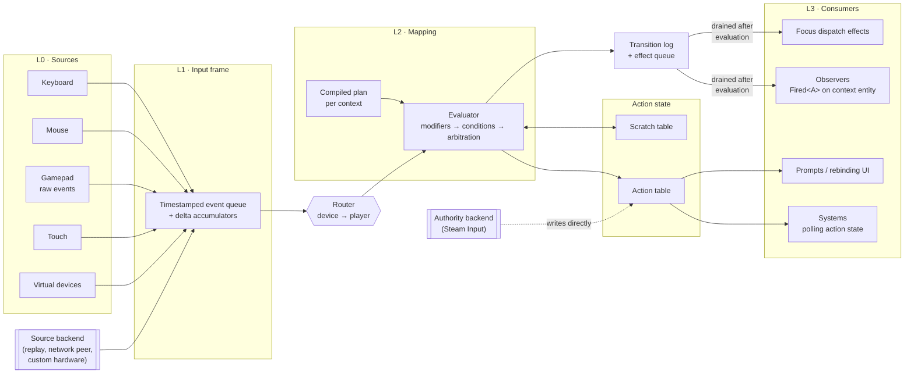
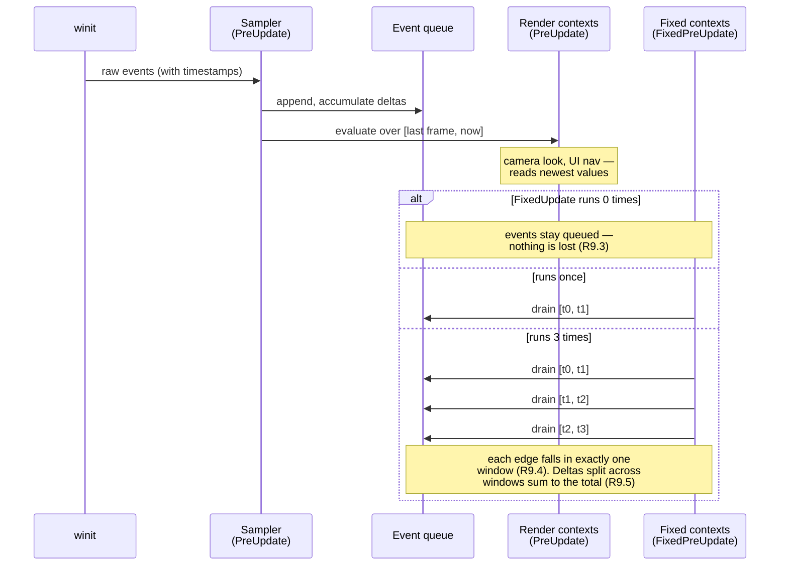
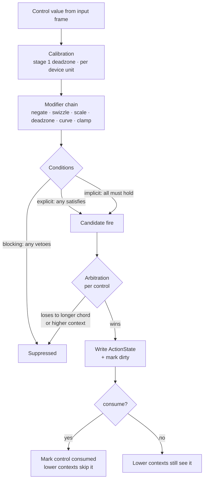

# Design overview: `bevy_action_map`

> Status: proposal for review. Companion to [Requirements.md](./Requirements.md); requirement tags
> like R9.3 and decision tags like D6 refer to that document. Where this design contradicts a
> requirement, that is a finding to resolve, not an oversight to route around — §12 lists the ones
> found so far.

This document proposes *how* to build the system the requirements describe. It commits to positions
on the three questions the requirements left open (OQ-3 state layout, OQ-5 extensibility, OQ-6
fixed/render state) rather than presenting a menu, so that the consequences are visible; §12 says what
would have to change if a commitment is rejected.

---

## 1. Architecture

Four layers, as in the requirements, made concrete. The important structural property is that **L2
reads only L1** (R0.2) — everything downstream of the input frame is a pure function, which is what
makes determinism, replay, testing, and external backends the same mechanism rather than four.



Two things to note in the diagram. The **authority backend** (D3) writes into the action table
directly, bypassing the evaluator entirely — Steam Input owns bindings, conditions and glyphs, and
`GetDigitalActionData` returns an answer we do not compute. The **source backend** enters at L1
instead, and is therefore indistinguishable from real hardware to everything above it; replay,
network input, and tests all use this door.

---

## 2. Data flow through one frame

The timing requirements (R9.3 no lost edges, R9.4 no duplicated edges, R9.5 conserved deltas) are
usually treated as three separate problems. They collapse into one if **L1 is a timestamped event
queue rather than a snapshot of booleans**, and fixed ticks drain it by time window.



A press and release inside a single render frame still occupy distinct positions in the queue, so a
fixed tick that spans them sees both — which is the case `ButtonInput` cannot express today
([bevy#6183](https://github.com/bevyengine/bevy/issues/6183)).

The queue is bounded: events older than the last fixed tick are retired each frame, and a
configurable cap drops oldest-first with a diagnostic rather than growing without limit if the app
stalls.

**Where the timestamps come from — a caveat.** Bevy's input events carry none: `MouseMotion` is
`{ delta }` and `KeyboardInput` is `{ key_code, logical_key, state, text, repeat, window }`. Until
that changes (§11 argues it should, upstream), the sampler stamps events at sample time, which
preserves their *order* but not their true instants. Order is what the order-sensitive conditions
need (R9.7), and splitting accumulated deltas across ticks still conserves magnitude (R9.5), so R9.3
and R9.4 hold regardless. What degrades is R9.8's sub-frame accuracy: when several events land in one
frame, they are placed in sequence rather than at the moments they occurred, and a tick boundary
falling mid-frame is approximated. Gamepads are coarser still: gilrs is polled once per frame, so
those events arrive as a batch regardless. [bevy#9087][bevy-9087] tracks fixing both; §11 covers what
that would change.

---

## 3. Core object model

```rust
/// Dense index into the global action registry. Assigned at registration,
/// stable within a process run; the serialized identity is the type path (R1.1).
#[derive(Clone, Copy, PartialEq, Eq, Hash, Reflect)]
pub struct ActionId(u32);

/// Compile-time handle to an action (D1). Implemented by the derive.
pub trait InputAction: Send + Sync + 'static {
    type Output: ActionOutput;          // bool, f32, Vec2, Vec3 — the value's *shape*
    const INTENT: Intent;               // what it *means* (R2.7) — see below
    const PATH: &'static str;           // "gameplay.move" — declared, required (D8)
    fn id() -> ActionId;                // interned, cached
}

/// Shape says how big a value is; intent says what it means (R2.7). A mouse
/// delta and a stick deflection are both Vec2 and must not be summed.
#[derive(Clone, Copy, PartialEq, Eq, Reflect)]
pub enum Intent {
    Button,        // digital
    Analog1,       // trigger-like
    Directional2,  // stick-like: a position implying a rate
    Delta2,        // mouse-like: a displacement already per-frame
}

/// One runtime value, any shape (R2.1).
#[derive(Clone, Copy, PartialEq, Reflect)]
pub enum ActionValue { Bool(bool), Axis1(f32), Axis2(Vec2), Axis3(Vec3) }

/// Per-action state. Uniform for every action — this is the key to §6.
#[derive(Clone, Copy, Reflect)]
pub struct ActionState {
    pub value: ActionValue,   // 20 B (tag + Vec3)
    pub phase: Phase,         //  1 B  Idle | Started | Ongoing | Fired | Completed | Canceled
    pub flags: StateFlags,    //  1 B  consumed, disabled, require_reset
    pub elapsed: f32,         //  4 B  in the context's clock (R9.6)
    pub progress: f32,        //  4 B  0..1 toward firing (R3.5)
}
```

A context is a declared type (mirroring D1 for actions), carrying its tick domain and priority:

```rust
pub trait InputContext: Send + Sync + 'static {
    const TICK: TickDomain;             // Render | Fixed
    const PRIORITY: i32;
}
```

### 3.1 Naming actions and contexts (D8, R1.8)

`PATH` is required on every action and context, and it is the string that ends up in the player's
settings file. R1.8 asks for one convention; this is it.

```
<namespace>.<name>
gameplay.jump          menu.confirm           vehicle.flight.throttle
```

| Rule | |
| --- | --- |
| Separator | `.` — never `::`, `/`, or a bare word |
| Case | `snake_case` throughout; no capitals, no hyphens |
| Segments | at least two: a namespace and a name. Intermediate segments group freely |
| Namespace | for an application, the functional area (`gameplay`, `menu`, `vehicle`). For a library, its crate name (`bevy_action_map.ui.submit`), which is what keeps R1.5's collisions away now that the compiler no longer prevents them |
| Contexts | the same scheme, in the same namespace as the actions they bind |

Two habits worth stating because the failure they prevent is silent:

- **The path does not have to match the Rust type, and should not be updated to follow it.** `Move`
  may become `MoveOnFoot` and relocate to another module; `gameplay.move` stays. That freedom is the
  entire point of declaring it (D8).
- **Changing a path is a save-data migration**, on the same footing as any other schema change
  (§17.R17.3). Renaming one is not a refactor; it orphans every binding a player has saved against it,
  and R17.2 will report those as unresolved rather than fail the load.

An **`InputContextState`** owns the state for one activation of a context — global, per player, or
per test harness, with identical storage in all three (R23.6). Inside an `App` it lives in a
component on an entity, which is what gives observers a target (§9.6); a "global" context is simply
one on a plugin-spawned entity. The struct itself holds no ECS references, so a test or replay
harness can drive one directly without a `World` (R0.3):

```rust
pub struct InputContextState {
    plan: Arc<Plan>,          // shared; rebuilt only when bindings change
    actions: Vec<ActionState>,// dense, indexed by plan slot
    scratch: Vec<Scratch>,    // dense, indexed by plan slot
    dirty: FixedBitSet,       // per-action change granularity (R23.4)
    active: bool,
}
```

---

## 4. The compiled plan

Bindings are authored as data, then **compiled** once into a per-context `Plan`. Compilation is where
the work that would otherwise be per-frame happens (R23.1, R7.6):

| Compilation produces | Serves |
| --- | --- |
| Action → slot assignment | O(1) state access without hashing (R23.5) |
| Scratch slot assignment per condition and stateful modifier | §6 |
| Each binding's chord length, and whether the plan has any | The clash pre-pass in §5, skipped entirely when it would find nothing (R8.1) |
| Reverse index: action → bindings | Prompt lookup without scanning (R18.1) |
| Resolved device-class filters | Per-player routing (R15.3) |
| Diagnostics: unknown controls, shape mismatches, duplicates | R4.8 |

The plan is immutable and `Arc`-shared between instances of the same context, so ten local players
sharing one binding set hold one plan and ten small state tables. It is invalidated by binding
mutation, device-class changes that affect resolution, and rebinding — never by activation, which only
flips `active`.

### 4.1 Where class bindings do not fit

The per-control arbitration index above assumes every binding names a control to be indexed under.
A class binding (R4.9) does not, and the obvious repair — expand a class to its member controls at
compile time — is unavailable for the class that matters most: "character-producing" is a function
of keyboard layout and live IME state, so its membership is not known when the plan is built
(R12.6).

So the plan carries **two** structures, and evaluation consults them in order:

1. the per-control index, walked as §5 describes; then
2. a short list of class bindings, tested against the event when no indexed binding claimed it.

Two consequences follow, and the second is counter-intuitive enough to be worth stating outright:

- The class list is short by construction, because R4.10 admits a class only where the set is not
  enumerable. If it ever grows long enough to matter per-frame, that is evidence the criterion has
  been abandoned rather than evidence the structure needs optimizing.
- **A class binding is maximally unspecific, so §5's clash rule works against it.** `Ctrl+S` beats
  "any character key" on chord length, and so does a plain `W` bound in the same context. A class
  binding therefore never wins by specificity — it wins only by sitting in a higher-priority
  context, which is exactly how a focused text field is meant to claim the keyboard (R8.2, D4).
  That the arbitration order also lets a text field's own `Ctrl+S` binding out-rank its character
  class is not a special case; it is the same rule, doing the right thing twice.

---

## 5. Evaluation pipeline



**Arbitration in one pass, resolved in two places.** The obvious shape — one list of every binding
that touches a control, sorted by (context priority, chord length) — cannot be built: a plan belongs
to one context and cannot see another's bindings, and §5.2 rules out one list spanning two
schedules. So the two halves of the sort are resolved separately, and each where it can be:

- **Context priority is system ordering.** `PRIORITY` is a const, so a context's evaluation is
  placed in a priority-keyed system set ordered against the others in its schedule, once at app
  build. A higher-priority context therefore runs first and gets to claim a control before anyone
  else reads it, with no per-frame decision to make.
- **Chord length is a pre-pass within one evaluation.** Whether a chord is satisfied is a pure
  function of what is held — no scratch, no conditions — so before any binding is read, the longest
  satisfied chord on each control is found. A binding whose chord is shorter than the winner on any
  of its controls reads as rest. `Ctrl+S` beats `S` by length alone, with nothing declared for it
  (R8.1), and a plan with no chords skips the pass entirely.

Consumption (R8.2) rides on the first of those: a binding marked `consume` records its controls when
it fires, and contexts evaluating later see them as untouched. Both halves are fixed before the
frame starts, which is what makes the pass deterministic with respect to system scheduling (R8.3).

### 5.1 Folding several bindings into one action

Arbitration above decides which binding claims a *control*. A separate question, and the one R4.1
forces, is what happens when several bindings survive and all feed the *same action* — `Jump` on both
Space and South, `Move` on both WASD and the left stick. State is allocated per action rather than per
binding, so their contributions have to be folded into one value, and summing is the wrong default:
adding a stick position to a key press produces a value with no meaning.

The action's declared **intent** (R2.7) is exactly the property that decides the rule, which is the
first place intent does load-bearing work rather than describing:

| Intent | Fold | Why |
| --- | --- | --- |
| `Button`, `Analog1`, `Directional2` | strongest contribution wins | These are presses and positions. Two half-deflected sticks are not a full deflection, and either of two jump buttons should jump exactly once. |
| `Delta2` | contributions are summed | A delta is a displacement already expressed per frame, so two devices moving at once should move the action by both. |

Ties keep the earlier contribution, so declaration order is the documented tiebreak. The plan groups
bindings by mapping at compile time, which makes the fold one pass over a sorted list with no
per-frame allocation (R23.2).

**What makes the mixing impossible rather than merely defined.** Keying the fold off the action's
intent stops the units error *between* actions, but on its own it would still accept a mouse delta
bound to a `Directional2` action. R2.10's source-channel shape is what closes that: every source
declares the channel it reports on, and a binding whose channel cannot serve the action's intent is
refused when the context is declared.

The one case that refusal leaves open is the near-universal one. A stick bound to a `Delta2` look
action is rejected, correctly — a position is a rate and a delta is a displacement — but R2.9 asks
for the conversion between them to be *explicit*, not absent, and an explicit rate-to-delta step
needs the tick's `dt`. Until it exists, one action cannot be driven by both a mouse and a stick.

**Nothing user-defined runs inside the evaluator.** Evaluation writes state and appends to a
**transition log** — every phase change, in order. Observers and effects are dispatched by a separate
system that drains that log after evaluation completes. This is what keeps the evaluator a pure
function (R10.2): observers run arbitrary code with `&mut World`, so they cannot run inside it. During
rollback resimulation the log is discarded rather than drained, so a resimulated tick does not re-fire
observers or re-dispatch effects.

Because the log records transitions rather than final state, an action that fires *and* completes
within one tick produces two entries and therefore two observer invocations, in order — which is what
R3.3 requires and what a "read the current phase" model cannot express.

---

### 5.2 Consumption across tick domains

Arbitration assumes every contender is considered together. Tick domains break that assumption: a
render-tick context evaluates in `PreUpdate` and a fixed-tick one in `FixedPreUpdate`, which runs
later in the frame and may run zero times or several. Two things follow, and they have to be decided
rather than discovered.

**Consumption is recorded per schedule, and a read consults all of them.** Each schedule clears its
own record when it runs; the frame's sampler clears every record once, at the top. So:

| | |
| --- | --- |
| `PreUpdate` consumes a control | every fixed tick in that frame sees it as taken |
| A fixed tick consumes a control | the next fixed tick does not — each tick is its own decision over its own window |
| No fixed tick runs at all | nothing is left behind, because the next frame's sampler clears it |

**The consequence, stated plainly: consumption flows forward in schedule order.** A render-tick
context can take a control from a fixed-tick one; a fixed-tick context cannot take one from a
render-tick one, whatever the priorities say. That is a real limitation and it is worth being honest
that priority is therefore not a total order across domains.

It is also the direction every motivating case runs in. A menu, a focused text field, a modal
overlay — the things that claim controls are UI, UI is render-tick, and the thing being claimed from
is gameplay, which is fixed-tick. The reverse — a physics tick out-ranking a menu — is not a case
anyone has asked for, and if one appears the answer is to give the claimant a render-tick context
rather than to reorder the frame.

`bevy_enhanced_input` reached the same arrangement from the same starting point: it lets a context
name its schedule, and keys its consumed set by `TypeId` of that schedule, clearing each schedule's
own record as it runs. Its stated reason is the multi-run case in the table above.

**Within one schedule, contexts evaluate in priority order.** `PRIORITY` is a const on the context
type, so the order is known when the context is declared, and evaluation is placed in a
priority-keyed system set ordered against the ones already registered. The number of distinct
priorities is small, and the ordering is fixed at app build rather than resolved per frame — which
is what keeps R8.3's single deterministic pass single and deterministic.

---

## 6. State and storage — the OQ-3 commitment

The requirements framed this as a choice between four layouts for one state store. The framing is
wrong: **the state divides in two, and the halves want different treatment.**

| | Holds | Shape | Belongs to |
| --- | --- | --- | --- |
| **Action state** | value, phase, elapsed, progress, flags | **uniform**, 32 B | the action |
| **Scratch** | hold timers, tap counts, chord progress, filter state | *appears* variable | the **binding's** conditions and modifiers |

The second row is the one that made a packed byte buffer look necessary. But once it is attributed to
bindings rather than actions, and the parameters (durations, thresholds, sequence definitions) are
recognized as living in the immutable plan rather than in state, what remains is small and uniform:

```rust
#[derive(Clone, Copy, Default, Reflect)]
pub struct Scratch {
    prev: ActionValue,  // previous input, or filter accumulator
    time: f32,          // press time, window start, or last fire
    count: u16,         // tap count, sequence progress index
    flags: u8,
}
```

Checked against every condition in R6.1 and every stateful modifier in R5.4:

| Condition | Uses |
| --- | --- |
| down/held, press edge, release edge | `prev` |
| hold-for-duration, hold-and-release | `time`, `flags` |
| tap | `time` |
| multi-tap / double-tap | `time`, `count` |
| pulse / repeat | `time`, `count` |
| chord, blocked-by | `prev` (other operands are read from their own mappings) |
| sequence / combo (R6.4) | `time`, `count` as progress index — the sequence itself is in the plan |
| smoothing, accumulation, rate limiting (R5.4) | `prev` as accumulator, `time` |

Nothing overflows, including the sequences the requirements expected to need an escape hatch. So both
tables are dense arrays of `Copy` types:

- **Snapshot/restore** for rollback (R10.3) is two slice copies plus the dirty bitset — no traversal,
  no allocation, no reflection.
- **Activation** flips `active`; no spawn, despawn, insert, or remove (R23.3).
- **Layers keep independent in-flight state** because each context instance owns its own tables
  (R23.7) — the failure mode that rules out any store keyed by `ActionId` alone.
- **Change granularity** is the dirty bitset, avoiding the all-or-nothing change ticks a single
  component would impose (R23.4).
- **Backends** write into the action table directly (R0.4).
- **Dynamic actions**, if ever added, get a mapping like any other (R1.3).
- Public types stay legible (R24.6) — no offsets, no `[u8; N]`, no unsafe.

`ActionId` being a dense `u32` makes the action→slot map a `Vec<u16>` indexed by id: two array
indexes, no hashing (R23.5).

---

## 7. Tick domains — the OQ-6 commitment

**A context declares its tick domain, and is evaluated exactly once, in that domain.**

```rust
#[derive(InputContext)]
#[context(path = "gameplay.on_foot", tick = Fixed)]     // gameplay: simulation rate
struct OnFoot;

#[derive(InputContext)]
#[context(path = "gameplay.free_look", tick = Render)]  // camera look: frame rate
struct FreeLook;
```

The alternative — every context evaluated at both rates — doubles state and evaluation to serve a case
most actions never need. Making the domain a context property means one state table per instance, one
evaluation, and an accessor type that follows from the domain, so reading a fixed-rate action from a
render-rate system is caught rather than silently wrong (R9.2).

**The cost, stated honestly:** an action needed at both rates must be declared in two contexts. In
practice the split falls where the semantics already differ — mouse-look wants the newest delta every
frame, movement wants exactly one sample per simulation tick — but a game that wants `Jump` visible to
both an animation system in `Update` and physics in `FixedUpdate` has to either read the fixed state
from `Update` (allowed, just a frame stale) or duplicate. §12 flags this as the commitment most likely
to need revisiting.

---

## 8. Extensibility — the OQ-5 commitment

A closed enum blocks third-party modifiers, which R5.6/R6.6 require. Pure trait objects cost dispatch
on every binding every tick and complicate serialization. The hybrid:

```rust
#[derive(Clone, Reflect)]
pub enum Modifier {
    Negate, Swizzle(Axes), Scale(f32), Clamp(f32, f32),
    DeadZone { shape: DeadZoneShape, lower: f32, rescale: bool },
    Curve(Response),
    Custom(Box<dyn CustomModifier>),
}

pub trait CustomModifier: Reflect + Send + Sync {
    /// Pure: no world access, no wall clock (R5.7).
    fn apply(&self, input: ActionValue, scratch: &mut Scratch, dt: f32) -> ActionValue;
}
```

Built-ins dispatch statically and stay exhaustively matchable; extensions work; both round-trip
through the type registry (R17.5). The boxes are allocated during plan compilation, never in the
steady state (R23.2). Conditions get the identical treatment.

Note `rescale` on `DeadZone`: D6 permits at most one rescaling stage, and making it explicit per
modifier is what lets calibration, design, and preference deadzones compose (R5.3).

### 8.1 The deadzone stages, and which one exists

D6 splits the deadzone into three stages because three parties have a claim on it and they are
answering different questions (Requirements §14). Only the middle one is built:

| Stage | Where it runs | Rescales | Status |
| --- | --- | --- | --- |
| **1 · Calibration** — this unit's true centre and rest envelope | L1→L2, before the modifier chain | no | not built |
| **2 · Design** — what shape and curve the mechanic wants | the binding's modifier chain | **yes**, by default | **built** |
| **3 · Preference** — the player's comfort adjustment | modulates stage 2 | no | not built |

Stage 2 is the one that rescales, and that assignment is not arbitrary. Rescaling is what makes a
deadzone feel like nothing was taken away — full deflection still reads 1.0 — and stage 2 is the only
stage whose threshold the player never sees a number for. If stage 1 rescaled instead, the
developer's `0.15` would stop denoting a physical stick position, which is precisely the failure D6's
one-rescaling-stage rule exists to prevent.

The rule is enforced where a plan is compiled: a binding whose chain stacks two rescaling modifiers
is rejected when its context is declared, naming the action. `Modifier::rescales` carries the same
obligation across to third-party modifiers, defaulting to `false` so that only a modifier that
deliberately stretches its range has to say so.

**Not yet answered by stage 2 alone.** Calibration is per device *unit* — drift is a wear
characteristic — so it needs the evaluator to stop merging every pad into one axis map, and
persistence needs the stable device identity of R11.5. Stage 3 needs the per-player scope of §15.
Both are the next chunk. Per OQ-4's sub-question, stage 1 will ship with a **manual calibration API
plus a sampling helper the app drives during an explicit "hold the stick still" step**, not
background auto-detection: a stick deflected while detection is running would be learned as centre,
and the misbehaving hardware in the README would poison it outright.

---

## 9. Developer experience

### 9.1 Worked example A — single-player, keyboard/mouse and gamepad

Everything needed to move, look, and jump on both device classes:

```rust
use bevy::prelude::*;
use bevy_action_map::prelude::*;

#[derive(InputAction)] #[action(path = "gameplay.move", output = Vec2, intent = Directional2)] struct Move;
#[derive(InputAction)] #[action(path = "gameplay.look", output = Vec2, intent = Delta2)]        struct Look;
#[derive(InputAction)] #[action(path = "gameplay.jump", output = bool, intent = Button)]        struct Jump;

#[derive(InputContext)] #[context(path = "gameplay.on_foot",   tick = Fixed)]  struct OnFoot;
#[derive(InputContext)] #[context(path = "gameplay.free_look", tick = Render)] struct FreeLook;

fn main() {
    App::new()
        .add_plugins((DefaultPlugins, ActionMapPlugin))
        .add_context(OnFoot, |c| {
            c.bind::<Move>(Wasd);
            c.bind::<Move>(Stick::Left.deadzone(Radial(0.15)));
            c.bind::<Jump>(KeyCode::Space);
            c.bind::<Jump>(GamepadButton::South);
        })
        .add_context(FreeLook, |c| {
            c.bind::<Look>(MouseMotion.scale(0.04));
            c.bind::<Look>(Stick::Right.deadzone(Radial(0.12)).curve(Exp(1.8)));
        })
        .add_systems(FixedUpdate, movement)
        .add_systems(Update, camera)
        .run();
}

fn movement(input: Actions<OnFoot>, mut t: Single<&mut Transform>) {
    let dir = input.value::<Move>();            // Vec2 — shape checked at compile time
    t.translation += Vec3::new(dir.x, 0.0, dir.y);
    if input.fired::<Jump>() { /* ... */ }
}

fn camera(input: Actions<FreeLook>, mut cam: Single<&mut Transform, With<Camera>>) {
    let d = input.value::<Look>();
    cam.rotate_y(-d.x);
}
```

Two device classes, four bindings, twelve lines of binding setup. `input.value::<Move>()` returns
`Vec2` — not `ActionValue` — because the derive carries the output as an associated type, so reading a
`Vec2` action as `bool` fails to compile rather than at runtime (R2.3).

The split into two contexts is the tick-domain decision (§7) surfacing in the API. It is visible, and
whether it reads as clarity or as ceremony is worth a judgement during review.

### 9.2 Worked example B — fixed-timestep gameplay and the injection path

Gameplay reads look identical to A: `Actions<OnFoot>` in `FixedUpdate` sees exactly one sample per
tick, with edges neither lost nor duplicated (§2). What a rollback layer needs is the ability to
replace L1 and re-run:

```rust
// Capture: what a netcode layer sends and stores per tick.
fn record(frames: Res<InputFrames>, mut log: ResMut<ReplayLog>) {
    log.push(frames.for_player(PlayerId(0)).clone());   // small, serializable (R10.1)
}

// Resimulate: rewind, then re-derive every tick since the misprediction.
fn resimulate(mut am: ActionMapRollback, saved: &StateSnapshot, frames: &[InputFrame]) {
    am.restore(saved);                    // two slice copies per context instance
    for frame in frames {
        am.tick(frame, FIXED_DT);         // pure: same input, same output
    }
    // Effects recorded during resimulation are discarded, not replayed (§5).
}
```

`StateSnapshot` is the action and scratch tables plus the dirty bits — nothing else, because the plan
is immutable and the parameters live in it. Tests use the same door: `am.tick(&synth_frame, dt)` in a
headless `App` with no windowing backend (R21.1), and time is a parameter rather than a clock read, so
hold conditions are testable without sleeping (R21.2).

### 9.3 What the derives generate

```rust
#[derive(InputAction)] #[action(path = "gameplay.move", output = Vec2, intent = Directional2)] struct Move;
```
expands to an `InputAction` impl carrying `type Output = Vec2`, `INTENT`, the declared `PATH`, and a
cached interned `id()`, plus registration in the **action registry** — path, category and intent
against the id — so persistence and external backends can resolve an action by name (R1.7). `path`
is required and unchecked against the Rust type (D8), so §3.1's convention is what keeps it
collision-free. `category` and `consume` cover the rest of R1.6, both as associated constants with
defaults so a hand-written impl need not mention them. Note that rebindability is deliberately *not*
here: it belongs to a mapping, not an action (§9.6).

_Not the **reflect** type registry, which an earlier draft of this section named. That keys types by
their Rust type path, which is the identity D8 exists to reject: what a settings file holds is the
declared path, and resolving it has to go through a table keyed the same way._

`#[derive(InputContext)]` additionally emits `Component`, `Default`, `Clone` and `Copy`. A context
that is not a component cannot be used — every entry point requires it — and a scene format needs
the other three to spawn one. A context needing different component configuration implements
`InputContext` by hand, which is three constants.

### 9.4 Binding combinators

Sources are values; modifiers are combinators on them:

```rust
Stick::Left.deadzone(Radial(0.15)).curve(Exp(1.8)).scale(2.0)
KeyCode::LControl.and(KeyCode::KeyS)        // chord
KeyCode::KeyC.hold(0.3)                     // condition
KeyCode::KeyF.tap().within(0.25)
Wasd                                        // named composite
Buttons::new(Up, Down, Left, Right)         // general composite
```

Chaining reads in evaluation order, which is also the order the plan stores them (R5.1). The
combinators are extension-trait methods, so a third-party modifier crate adds its own without
touching ours.

### 9.5 Diagnostics — three tiers

Failures should surface at the earliest tier that can catch them:

| Tier | Catches | Looks like |
| --- | --- | --- |
| **Compile time** | wrong output shape, unknown action type | `expected Vec2, found bool` |
| **Plan build** | unknown control, duplicate binding, shape mismatch a conversion cannot fix, contradictory consume flags | a `Result` from `add_context`, or collected into a diagnostics resource and logged once — never silent (R4.8) |
| **Runtime query** | everything situational | `input.why::<Jump>()` → `NotFired::ConsumedBy { context, binding }` (R22.1) |

The runtime query is the one that pays for itself. "Why didn't my action fire" has at least five
causes that are indistinguishable from the call site — inactive context, higher-priority consumer,
longer chord winning the clash, unmet condition, device not owned by this player — and the plan
already holds everything needed to answer.

### 9.6 Observers

Polling suits simulation code, which wants to ask "what is the movement vector this tick". It suits
one-shot commands badly — and it is not what a declarative scene format can express. Both are
supported (R3.2); observers are the second half.

Transitions are published as **generic entity events targeted at the entity carrying the context
instance**. The generic parameter carries the action identity, so no per-action entity is needed:

```rust
#[derive(EntityEvent)]
pub struct Fired<A: InputAction> {
    #[event_target]
    pub context: Entity,
    pub value: A::Output,
}
// likewise Started<A>, Completed<A>, Canceled<A>
```

The precedent is [`bevy_input_focus::FocusedInput<M>`][bevy-input-focus] — generic, deriving
`EntityEvent`, designating its target with `#[event_target]`.

`bevy_picking` is deliberately *not* the precedent here, despite having recently flattened its
generic `Pointer<E>` into concrete per-event structs. It could do that because its event set is
closed and known at compile time. Ours is open by D1 — any crate may declare an action — so there is
no finite set of concrete event types to write, and the generic form is a structural requirement
rather than a stylistic preference. Picking's direction of travel should not be read as an argument
against it.

**The context type is itself the component**, so that spawning is sufficient (R22.14):

```rust
#[derive(InputContext, Component)]
#[context(path = "gameplay.on_foot", tick = Fixed)]
struct OnFoot;
```

A component lifecycle hook on insertion resolves the plan and allocates the state tables, so no
registration call stands between spawning an entity and its input working.

One ordering constraint falls out of this and is worth stating, because it is a property of Bevy
rather than a choice: a hook can only be attached to a component type while no entity carries it
yet, so **a context must be declared before anything spawns into it**. Declaration is an app-build
step and spawning is a runtime one, so the constraint is invisible in normal use — but it does rule
out introducing a new context type mid-session, and it means the diagnostic for getting it backwards
has to name `add_context` rather than leaving Bevy's own assertion to explain itself.

```rust
// Imperative
commands.entity(player)
    .insert(OnFoot)
    .observe(|ev: On<Fired<Jump>>, mut q: Query<&mut Velocity>| {
        q.get_mut(ev.context).unwrap().y = JUMP_SPEED;
    });

// Global: every context instance — logging, debug overlays
app.add_observer(|ev: On<Fired<Jump>>| info!("jump on {:?}", ev.context));
```

### 9.6.1 BSN

`bevy_scene`'s [`on()`][bevy-scene] takes any `E: EventPattern<Event: EntityEvent>` and attaches an
observer to the scene entity, so the events above are usable from `bsn!` with no adapter:

```rust
fn player() -> impl Scene {
    bsn! {
        OnFoot
        Velocity(Vec3::ZERO)
        on(|ev: On<Fired<Jump>>, mut q: Query<&mut Velocity>| {
            q.get_mut(ev.context).unwrap().y = JUMP_SPEED;
        })
    }
}
```

That template is the whole integration: a scene declares that an entity has an input context and how
it responds, with no system, no registration, and no setup ordering. This is the reason to target the
context entity rather than a resource-level event stream — **it is the shape a declarative format can
express** — and the reason the context type is a component rather than a handle returned by a builder.

Three properties follow from §5's transition log:

- **Observers never run inside the evaluator**, so arbitrary `&mut World` access cannot break the
  purity that rollback depends on (R10.2).
- **Resimulated ticks do not re-fire observers.** A rollback re-derives state silently; only the
  authoritative pass dispatches.
- **Cost is proportional to transitions, not to actions.** The log holds what changed, so an idle
  frame dispatches nothing.

The ordering guarantee is that observers for a `Fixed` context run at simulation rate, in
`FixedPostUpdate`, after that tick's evaluation — not at render rate, which would silently
double-fire during catch-up.

### 9.7 The player-facing surface (D7)

The binding model above is a *developer* model. Players get a deliberately smaller one, because the
internal model has no player-comprehensible reading — nobody rebinding "move forward" should meet a
swizzle. D7 separates the two, and the separation costs less than it sounds: the player-facing surface
is three additive declarations over bindings that already exist.

```rust
app.add_context::<OnFoot>(|c| {
    // One mapping per composite part — `Move` itself is never rebindable (R19.9), and the four parts
    // name themselves, so the keys are `gameplay.move.up` and its three neighbours (R19.14).
    c.bind::<Move>(DirectionalButtons::wasd()).mappable();

    c.bind::<Move>(Stick::Left).dead_zone(DeadZone::radial(0.15));
    // sticks are not per-mapping rebindable; they get a tunable instead (R19.11)

    c.bind::<Jump>(KeyCode::Space).mappable();
    c.bind::<Jump>(GamepadButton::South);   // listed on the controls screen, but not rebindable
});
```

**Three states, not two.** A binding is *listed and fixed* unless it says otherwise, *listed and
rebindable* if it declares a mapping, and *unlisted* only if it asks:

| declaration | listed | rebindable |
| --- | --- | --- |
| (none) | yes | no |
| `mappable` | yes | yes |
| `private` | no | no |

The first draft had two states and made listing follow rebindability, so the gamepad `Jump` above
vanished from the screen entirely. That is backwards for the commonest gamepad screen there is: the
console or Steam owns the remapping, the game still wants to *show* the player what the pad does,
and under opt-in listing there was no data to draw it from — the crate knew the binding and refused
to say so. Rebindability is the developer's call because a fixed binding is a design decision;
seeing the controls is the player's business, and the default belongs to them (R19.10).

`private` is for where listing is genuinely wrong: a binding that reads a control already shown
under another name, so a screen listing it again shows one key twice under two headings.
Disasteroids' `Afterburner` — the throttle, held — is the example, and it is also the example of
what the model cannot yet say. Those bindings do not merely duplicate `Thrust`'s keys, they *follow*
them, and nothing here makes a rebind of one move the other; `private` hides the duplicate row
without linking the two, which is a stopgap rather than the answer.

**`mappable` takes no arguments, and both halves of that are decisions.**

*The parts name themselves.* An earlier draft had the author supply them —
`mappable_parts(["forward", "back", …])` — which is a positional list to keep in step with a
struct's fields, and a second vocabulary for the same four things. A composite already knows its
parts are up, down, left and right, so the key derives as `gameplay.move.up` and the catalogue is
where `up` becomes "Move Forward". The author supplying "forward" would be naming the same part
twice, in a place no translator will look.

*The scheme is inferred from the controls.* A mapping belongs to keyboard-and-mouse or to gamepad,
and the binding's own controls already say which. Declaring it would be a third chance to disagree
with what is actually bound. A binding whose parts span both is refused when the context is
declared, since there is then no one scheme to rebind it in — which is a thing nobody writes on
purpose.

*Uniqueness is per scheme, not per context.* Binding one action to a key and to a pad button, both
mappable, derives the same mapping name twice — and is the ordinary way to write a game that offers
rebinding on both devices. The two are rebound independently (R19.7) and stored in separate tables
(§10.1), so only a repeat *within* one scheme is a collision. Both collision checks are keyed by
scheme and name together for that reason.

*And only where something is rebindable.* Listing by default means one action bound in two contexts
now produces two listed rows under one name without anyone asking for it, and that is not a fault:
the store a duplicate key could corrupt holds rebinds (§10.1), and a fixed row never reaches it. So
both checks require at least one side to be rebindable, and the error appears the moment a `mappable`
is added to either — which is when it starts to mean something.

An explicit name stays available for the case that needs it: `mappable_as("gameplay.strafe")`
replaces the derived prefix, and is the remedy the collision diagnostic names.

**A mapping holds a list of slots, and that list is what "primary and secondary" is.** A row on a
shipped game's keyboard table has two cells, and the first model here had one control per mapping,
which cannot say that at all. The workaround it forced was a second row under an alias name —
Disasteroids had `disasteroids.thrust` and `disasteroids.thrust_alt`, telling the player two things
are separate when they are the same thing twice. So `Mapping::slots` is an ordered `Vec<Control>`,
and declaring two mappable bindings of one action in one scheme is how a game ships both defaults:

```rust
c.bind::<Thrust>(KeyCode::KeyW).mappable();      // one mapping…
c.bind::<Thrust>(KeyCode::ArrowUp).mappable();   // …two slots
```

They derive the same key, and R19.15's collision check now consults the *action* as well: same name
plus same scheme plus same action is a merge, and what stays an error is two **different** actions
reaching for one name. Order is data rather than an artefact of iteration, because order is what
makes the first slot the primary one.

**The two nouns, since the first draft got them the wrong way round.** A *mapping* is the named
thing a player rebinds — "Move Forward" — and a *slot* is one position in it, holding one control.
The first version called the row a slot and had to invent a second word for the position; "cell" was
what it reached for, and a cell belongs to the table a screen draws rather than to the model behind
it. Naming the position `slot` also agrees with the two uses the word already had in the
crate, both of which mean an indexed position in a list. **A screen draws one cell per slot**, and
that sentence is the whole of the relationship: `cell` stays a presentation word and never appears
in the model.

*Capacity is inferred and raised, never lowered.* `Capacity::UpTo(n)` or `Capacity::Any`, and three
rules decide it: a plain `mappable` asks for one; several bindings feeding one mapping take the
widest anything asked for; and afterwards no mapping is narrower than the defaults it already holds.
So the two lines above produce `UpTo(2)` with nobody saying "2", and `mappable_upto(2)` on a single
default is how a game ships one control and leaves the second slot for the player to fill.

The alternatives were a fixed two and unbounded-only, and the prior art splits: games use a small
fixed number and label the columns, tools (Blender, VS Code) grow an "add shortcut" button, engines
offer unbounded as an authoring surface. A capacity covers all three, and `capacity.slots()` is what
a table asks to know how many columns to draw — `None` meaning the row grows instead.

*It is a list, not a set.* Nothing stops a player putting one control in two slots of one mapping;
that is a question for the conflict *policy* that applies a rebind rather than for the model, and
`conflicts` deliberately excludes the whole target mapping rather than the one slot being filled.

A rebinding UI then needs no knowledge of this crate's internals:

```rust
for mapping in mapping::mappings(world) {
    // mapping.key      -> "gameplay.move.up"        — a key, not text (R19.14)
    // mapping.category -> Some("gameplay.movement") — from the action (R1.6)
    // mapping.slots    -> [Control::Key(KeyCode::KeyW)]  — ordered; slot 0 is the primary
    // mapping.capacity -> Capacity::UpTo(2)         — how many slots, so how many columns
    // mapping.scheme   -> Scheme::KeyboardMouse     — one screenful at a time
    // mapping.accepts  -> ChannelShape::Button      — filters what capture will take (R19.1)
    // mapping.rebinding-> Rebinding::Here           — or `Fixed`: draw the row, offer no button

    let label = i18n.get(mapping.key)                 // the app's localization layer...
        .unwrap_or_else(|| mapping.key.fallback_label()); // ...or readable text without one (R19.13)
    // A category is a key on the same terms, and a screen drawing headings needs the same fallback.
    let heading = mapping.category.map(|c| mapping::fallback_label(c));
}
for t in mapping::tunables(world) {
    // t.key, and a typed range the UI renders as a slider or checkbox
}
```

The list is a flat one across every context, and nothing in it names an action or a context type —
it goes through the same type-erased door §10's inspection does, so a screen written against it
works for a game it was not compiled with. Grouping is the caller's: by `category` for headings,
by `scheme` for which device's worth to show — and because a category is a localization key like
any other, `mapping::fallback_label` renders one for the game that ships no catalogue, which is the
same courtesy `MappingKey` gets and is written in terms of.

The keys are the whole player-facing vocabulary, and none of them is a string this crate renders.
That is what keeps R18.3's "no hard-coded English" honest across a whole rebinding row rather than
only the control column — and it is why a mapping carries a key rather than a label: a
label would be a second string to translate, sitting in the binding declaration where no translator
will look for it.

Three properties worth noting:

- **Composites are invisible.** `Move` is one action with a 2D value, but the player sees four
  button mappings, which is how every shipped game presents it. The composite exists only on the
  developer side.
- **Rebindability is opt-in and per binding**, not per action. The gamepad `Jump` binding above has
  no mapping, so the UI draws its row without a button to press — the right default, given that
  gamepad remapping is usually handled by the console OS or Steam anyway.
- **Tunables are typed, so the UI is generic.** `DeadzoneAmount` with a range renders as a slider
  without the UI knowing it drives a modifier parameter. This is what R20.5 needs and what keeps R5.8
  (modifiers never shown to players) satisfiable.

**Presets** (R19.12) are a named set of mapping assignments and tunable values applied as a unit —
how "Southpaw" is actually shipped, and the only remapping story for device classes where
per-mapping rebinding is not offered.

---

## 10. Sketched, not designed

Enough to show the architecture accommodates them; each deserves its own document.

- **Devices and pairing** (Requirements §11, §15)**.** A `DeviceId` registry with persistent identity (vendor/product/
  serial or SDL GUID) distinct from the runtime handle. Device→player is a many-to-many table
  consulted by the router between L1 and L2, so an unowned device's input never reaches a player's
  evaluator. Join-by-button-press works by evaluating a designated context against *unassigned*
  devices.
- **Presentation** (Requirements §18)**.** Glyph resolution returns an identifier, or an opaque
  handle when an authority backend supplies it. Everything else here is built: the naming half in
  §10.3 and the reverse lookup in §10.6.
- **Persistence** (Requirements §17)**.** Designed in §10.1 rather than sketched.
- **Rebinding** (Requirements §19)**.** Designed in §9.7 rather than sketched, because D7 changed what it operates on.

### 10.1 The overrides structure

Overrides are a diff against the compiled defaults (R17.1), and the crate defines the structure that
holds them — `Reflect` and serde behind the `serialize` feature — while knowing nothing about where
it ends up. A game drops it inside its own settings resource, sends it to an account service, or
writes it wherever it likes.

**Rows are keyed by mapping, and hold that mapping's list of controls.** Three properties decide
that, and each rules out the obvious alternative of one row per action:

- an action has several bindings (R4.1), so `Jump` is Space *and* South;
- the unit of rebinding is the mapping, not the action (R19.9) — the player rebinds "move forward",
  never `Move`;
- only the source belongs to the player. Modifiers, conditions and chord structure are developer
  data (R5.8), and the knobs a player does get are tunables (R19.11), which are typed and live in
  their own table.

So a row's key is the mapping key R19.14 already derives — the action's path plus the part name —
and its value is encoded controls, not an encoded binding. Add the per-scheme separation R17.4
requires and the whole thing is legible in whatever format the app writes:

```toml
version = 1

[bindings.kbm]
"gameplay.move.forward" = "key/KeyW"
"gameplay.jump"         = ["key/Space", "key/KeyJ"]   # primary, secondary
"editor.save"           = "key/ControlLeft+key/KeyS"

[bindings.gamepad]
"gameplay.jump" = "pad/South"

[tunables.gamepad]
"gameplay.look.sensitivity" = 2.5
```

**A row holds a list because a mapping does** (R19.9), and the two must agree or a secondary could
be bound and not saved. **A scalar is the same thing as a one-element list**, and the format should
accept both on the way in and write the shorter form out: most rows hold one control, and a file a
player edits by hand should not make them type brackets to say so. **Position in the list is
meaningful** — it is which slot the control sits in — so the list is written in order and a cleared
middle slot needs the cleared marker R17.7 already requires rather than a shortened list, which
would silently promote the secondary to primary.

**A row is a whole mapping, not one slot.** Applying an override replaces the mapping's list, and
the slot-level edit a screen performs — "put this in the secondary" — is done by the screen against
the list before it writes the row. That keeps the store's unit the same as the requirement's unit,
and keeps a row from meaning something different depending on how many slots the build happens to
have.

**Three states, not two** (R17.7). Because absence already means "use the default", a player who
clears a binding has nothing left to say with unless clearing has its own value — and an action an
external backend owns (D3) must read as neither. The loader therefore distinguishes absent, cleared,
and not ours, and the writer never invents a row for the third.

**No device identity anywhere in it** (R17.8). A row names a control on a device *class*. Which
physical unit drives which player is pairing state and which stick rests where is calibration state,
and both are keyed by persistent device identity rather than by profile. That separation is what
makes two players with identical controllers and identical mappings share one override table and
differ only in pairing.

**The control encoding is a format we own** (R17.9), not `Debug` and not serde on `KeyCode`: those
names belong to Bevy, and a rename upstream would silently orphan every saved binding. It has to
carry the physical/logical distinction (R12.1) and the device class, and it is round-trip tested
like any other serialized identity.

**Applying is the only path in.** An override set is applied to a live context — compiling a variant
plan and swapping it into that entity's state — and startup is simply the first call. This is not a
convenience: an authority backend can rewrite its bindings mid-session (R18.10), so mid-session
application is the normal case on at least one platform, and building a startup path plus a reload
path bolted on afterwards would get it wrong twice. Swapping cancels in-flight actions and re-arms
require-reset, which is what `deactivate` and `activate` already do (R7.4, R7.5).

**Loading is pure and reports rather than drops** (R17.2). It is a function from (defaults,
overrides) to (bindings, problems), where a problem is an unknown action path, an unknown control
name, a mapping that no longer exists, or a control whose shape the mapping cannot accept — the same
diagnostic shape §9.5's plan-build tier produces, and reportable through the same type.

### 10.2 What Steam's IGA file is, and is not

Worth recording because it is easy to reach for as a model for the above, and it is a model for
something else entirely. The [IGA file][steam-iga] declares **action sets, layers, and actions with
their types**; the bindings live per-user in Steam's own storage, authored in its overlay. It is
therefore the counterpart of our action *declarations* rather than of our overrides, and we already
match it: their `Button` / `AnalogTrigger` / `StickPadGyro` plus `input_mode` is our `Intent`,
existing for the same reason of constraining what a binding UI may offer (R2.8, R19.1), and their
localization block is R19.14's decision that player-visible names are keys.

Two differences are worth carrying forward. Steam requires the action names in that file to match
the names in the game's code exactly, with nothing checking it — which is why R1.7 exists, and which
we avoid by declaring the path once in the derive rather than growing a second file to keep in step.
And a Steam action belongs to exactly one action set, while ours may be bound in any number of
contexts: the same tension as R19.15's colliding mapping keys, arriving from another direction, and
worth settling once rather than twice. _(Settled in §10.5: a context is a layer, and an action bound
in several contexts is declared once in the base set.)_

The correspondence with `Intent` is close but not exact, in one place. `Button` and `AnalogTrigger`
are our `Button` and `Analog1`, but `StickPadGyro` carries an `input_mode` that selects between
`joystick_move` and `absolute_mouse` — our `Axis2` and our `Delta2`, which chunk 15 deliberately
separated because a position and a rate need different modifiers and answer differently to a
deadzone. A backend therefore declares one Steam action where we declare one of two intents, and it
is `input_mode` rather than the type that says which.

### 10.3 Naming a control

A control needs two strings, and conflating them is the mistake worth designing against: one goes
into a settings file and must mean the same thing next year, the other goes on screen and must be
readable in the player's language.

**One name serves as both the stored identity and the localization key.** `key/KeyW` is what a
settings file holds (R17.9) and what an app's catalogue answers to (R18.3), which is the same
economy `MappingKey` already gets — a rebinding row is then two keys and two lookups, with nothing
in it this crate renders. `fallback_label` is the readable text for a game with no catalogue,
required by R19.13 so that shipping translations is never the price of a legible screen.

**The table is ours rather than derived from Bevy's names**, which costs about two hundred lines and
buys the thing R17.9 asks for: an upstream rename becomes a compile error in an exhaustive match
while the stored string stays what it was. It also lets the labels say what the controls are rather
than what Bevy calls them — `LeftTrigger` is a bumper and `LeftTrigger2` is the trigger, which is
worth correcting in the one place a player reads. The mouse's thumb buttons are the same call from
the other direction: they are stored as `mouse/Back` and `mouse/Forward`, because that is what the
backend reports and the stored string must not drift, and shown as **Mouse 4** and **Mouse 5**,
because that is what every other settings screen the player has seen calls them. An unnamed button
reads as "Mouse Button 7" rather than "Mouse 7", so a raw index can never be mistaken for one of
those two.

**What the fallback cannot do, stated rather than papered over.** It answers for a US keyboard, so a
binding to a physical key shows an AZERTY player the wrong letter — R12.2 calls that a bug, and it
is one the crate cannot fix alone: nothing in Bevy reports what a physical key produces on the
current layout outside an event that has already happened. An app supplies the control half of its
catalogue per layout; and once capture lands, the crate can remember the logical key observed at the
moment a player bound something, which is right for every binding they chose themselves. Recorded
here rather than solved, because the solution is a chunk of its own.

**Composite structure is not built.** R18.3 also asks for "hold" and "chord of A and B" as structure
a renderer can compose. Nothing shows a chord yet; when something does, it is a descriptor wrapping
these names rather than a change to them.

### 10.4 Capture

Every other path through the crate turns a control into a value and discards the control on the way.
Rebinding wants exactly the discarded half, so capture reads L1 directly rather than going through a
binding (R19.1) — which is also what makes R19.5 structural: a main-menu settings screen has no
gameplay contexts spawned and no evaluator stepping, and capture does not notice.

**A capture fills a slot, not a mapping.** A mapping holds an ordered list of slots (§9.7), so a
session carries which one the player activated and `Captured` echoes that back — without it the
answer has nowhere to go but the front of the row, and the secondary column could never be filled at
all. `CaptureSession::for_mapping` takes the first slot and `for_slot` names another; a slot past
the mapping's capacity, or more than one past what it currently holds, is refused, which is what
stops a capture leaving a hole in a list whose *order* is what primary and secondary mean.

**A session is a component, and it goes on whatever entity the caller picks.** Usually the settings
row the player activated, so that "which row is listening" is answered by where the component is
rather than by the screen keeping that state beside a global session. With several slots per row,
that entity is usually the individual cell button — so the slot on the event is for the *override*
the observer writes rather than for finding the widget again. The crate answers with a
`Captured` event on that same entity and removes the component; removing it yourself cancels. It
never touches the player or context entities, which is why a screen reached from the main menu works
the same as one reached from a pause menu.

**Arming costs a frame, deliberately.** The press that opened the capture is still in the queue when
the session arrives, so a session that read the queue immediately would bind whichever key the player
activated the row with. A session therefore skips whatever is already queued on its first run.

**Three refusals that look alike and are not.** *Shape and scheme* are the mapping's own constraints
— a keyboard row takes a key, not a pad button, because a rebind is scoped to one scheme (R19.7) and
crossing schemes would mean a different mapping. *Excluded* is the screen's own controls (R19.2),
and is silent: an excluded control is not being refused, it is busy doing its normal job, which is
how the key that cancels a capture reaches the thing that cancels it. *Reserved* is declared on a
binding and is loud, because a player who pressed it meant to bind it.

**Reserving settles OQ-10, and the second half is the half that matters.** A reserved binding takes
no mapping *and* its controls are refused by capture across the scheme. Without the second half a
player cannot rebind the settings key away but can still bind something else over it, which is the
same trap through another door. Reserving and declaring a mapping contradict each other, and
declaring both is a plan-build error.

**Only deliberate arrivals are refused out loud.** A stick drifts and a mouse twitches; a screen that
complained about every reading past its threshold would do nothing else. A press is refused loudly, a
continuous reading is dropped quietly, and both are claimed so that neither also plays the game.

**Conflicts are detected, not resolved.** Which mappings already hold a control is a pure query over
the mapping list, answerable before anything is committed to (R8.6). It is deliberately not carried
on the `Captured` event: answering it means reading every declared context, which capture cannot do
from the middle of the input pipeline, and what to *do* about a clash — reject, swap, unbind the
other — is a policy that needs somewhere to write the answer. Three limits are worth stating.
Comparison is at control granularity, so two bindings differing only in their chords are reported as
overlapping even though arbitration would separate them — a false positive rather than a false
negative. A clash across two contexts is reported as *possible* rather than certain, because whether
two contexts are ever live together is a question about the game's own activation rules. And the
*whole* target mapping is excluded rather than the one slot being filled, so a control repeated
across two slots of one row is not reported here — a repeat within one row is a policy question, and
belongs with the others.

**There is no class of two-dimensional controls,** though R4.9's vocabulary was expected to have
one. No single control reports a position in two dimensions: a stick is two axes and a directional
composite is four buttons. Since a player rebinds one part at a time (R19.9), the case it would
serve never reaches capture — and a mapping that accepts `Axis2` is a stick or mouse bound whole,
which §9.7 gives a tunable rather than a rebinding row. `CaptureSession::for_slot` returns `None`
for one rather than offering a capture that can never be satisfied.

### 10.5 The backend seam, concretely

D3 is the one structural commitment in §0 that had never been checked against the thing it exists
for. This section does that: it records what Steam Input is, settles the three places its model
genuinely disagrees with ours, and states the dependency position so it is not relitigated. It does
not design the traits — `backend/` is still a stub, and the traits want the second implementer §11's
gate asks for.

**What the API is.** [`ISteamInput`][steam-isteaminput] is an action API, not a device API, which is
why §0 classes it as an *authority* backend rather than a source. The game ships an [IGA
file][steam-iga] declaring action sets and actions by name and type; the bindings live per-user in
Steam's storage, authored in its overlay. At runtime the game calls `RunFrame` each tick and polls,
per controller and per action:

| Steam | Returns | Ours |
| --- | --- | --- |
| `GetDigitalActionData` | `{ bState, bActive }` | a `Button` level, with no edge and no timestamp |
| `GetAnalogActionData` | `{ eMode, x, y, bActive }` | `Analog1`/`Axis2`/`Delta2`, `eMode` saying which |
| `GetDigitalActionOrigins` | up to eight `EInputActionOrigin` | R18.1's reverse lookup, already ranked |
| `GetGlyphPNGForActionOrigin` | a **path to a file on disk** | R18.4's glyph id |
| `ShowBindingPanel` | opens the overlay | R19.8's delegation |
| `SteamInputConfigurationLoaded_t` | fires when the user saves | R18.5's invalidation, driven from outside |

`bActive` is worth naming on its own, because it does not mean "the value is zero": it means *this
action has no binding in the active set*, which is our `why_not` diagnostic arriving from the far
side of the seam. A backend must be able to report it and a prompt must be able to render it, or a
player who unbound something in the overlay reads a caption for a control that does nothing.

**An authority backend writes a value, not a state.** Steam returns a level, sampled when asked, with
no edge and no timestamp, so §9's timing is unsatisfiable from it — a press and release inside one
tick collapse, and `.hold()` and `.multi_tap()` have nothing to measure. But `fired()` and `Phase`
have to keep working or R0.5 is false. Both hold if the backend's write enters the pipeline **at the
button state machine rather than after it**: the backend supplies the value that the fold would
otherwise have produced, and our existing transition code diffs it and synthesizes the edges.
Bindings, modifiers and conditions are skipped, which is what R0.4 and R14.10 already require, and
the deadzone stages are not reapplied because there is no binding to apply them from.

This also settles what per-action authority *is* mechanically. It is a per-slot substitution of the
fold's output inside the evaluator, not a second write path into `InputContextState::actions` — which
matters, because a second write path would have to reimplement the state machine, and two
implementations of R6.1 is exactly the drift R0.5 forbids.

The corollary is that Steam's activators are where hold and multi-tap go, and they are the reason
the overlay has them. So a condition or modifier attached to a backend-owned action is a
**plan-build diagnostic at §9.5's error tier**, not a silent no-op: the game asked for behaviour the
backend will not deliver and nothing else would tell it. Disasteroids is already the test case —
`Hyperspace` carries `.multi_tap(2, 0.3)` and `Afterburner` a `.hold(0.75)` on the same trigger as
`Thrust`.

**Contexts become one action set plus a layer each.** Steam allows exactly one action set active per
controller, plus a stack of layers; we run any number of contexts at once, priority-ordered, with
consumption between them. Layers are the fit: they stack, and they override in the direction our
priorities already do, so a backend activates one base set for the game and pushes and pops a layer
as each context activates and deactivates.

The finding worth recording beside it is that the mismatch §10.2 flagged is narrower than it looked,
because **a context that is always active is not a mode**. Disasteroids' `Shell` holds `Pause`
unconditionally, so `Pause` belongs in the base set and there is no layer at all; only `Flying`,
which is gated on a state, becomes one. The tension survives for genuinely overlapping modal
contexts and for consumption, which layers cannot express — a lower layer's action is shadowed or it
is not, and there is no equivalent of one context claiming a control for a frame. That is the same
problem as R19.15's colliding mapping keys seen from another direction, and it is now settled in one
place rather than two: **a context is a layer, and an action bound in several contexts is one Steam
action declared once in the base set.**

**The seam needs L0 suppression, and nothing provides it.** When Steam drives a pad in gamepad
emulation the OS exposes a virtual pad that Bevy enumerates, so `sample_input` records
`RawGamepadEvent` for the same physical motion the backend is reporting, and every input arrives
twice. Steam stops emulating for controllers whose configuration is of the Steam Input API type once
the game declares support in the partner backend — but that is a shipping-time property, not one that
holds while the feature is being built, and it never covers a pad the game does not own.

R0.4 covers L2: our pipeline must not also *compute* a backend-owned action. Nothing covers L0, where
the raw events are still being sampled, so R0.6 says a backend authoritative for a device can
suppress that device before the frame. It is not a Steam workaround — a replay backend has to mute
live hardware for exactly the same reason, and it is the difference between a demo that works and one
that reads every input twice. The filter's key is whatever §11's persistent `DeviceId` becomes; until
that exists the runtime gamepad entity is the stopgap, which is enough for one process and wrong
across a reconnect.

**The real backend is out of tree, and that constrains the seam rather than the packaging.**
`steamworks` is `std`-only, is `unsafe` FFI beneath, and wants the Steamworks redistributable at link
time; this crate is `no_std`, `forbid(unsafe_code)`, and deliberately minimal in its dependency
surface because it is a candidate for upstream. So `bevy_action_map_steam` is someone else's crate,
and **nothing under `src/` may name Steam** — not a feature, not a variant, not a trait method. The
test of whether the seam is sufficient without being Steam-shaped is a mock authority backend living
entirely in `examples/`, which is what the roadmap's gate asks for and what will find the places this
section guessed.

Four things about the SDK that cost a day if they are discovered rather than read. Handles are zero
until the controller's configuration loads, so `GetActionSetHandle` is retried rather than fetched
once at startup. `RunFrame` is per tick and skipping it silently freezes every value. The IGA file
lives at `<install>/controller_config/game_actions_<appid>.vdf`, which means a real appid — or
Spacewar's 480 with a `steam_appid.txt` beside the binary, for experiments. And origins are Steam's
own enumeration of physical controls, not ours: `EInputActionOrigin` covers device families we have
no `Control` for and never will, which is R18.9's point and chunk 40's review surface.

### 10.6 The reverse lookup

R18.1 asks the question every other path through the crate throws away the answer to: given an
action, which control fires it. `Prompts::prompts(action, scope)` answers it, and the shape of the
answer is decided by three things that are easier to get right before there are callers than after.

**It is a trait, and the answer is not a `Control`.** R18.8 makes the lookup a trait because our
binding tables are not always the authority; R18.9 goes further and observes that a backend's
origins are *its own enumeration* of physical controls, covering device families we have no variant
for. So the return type is a `ControlOrigin`, which is either one of ours or a name-plus-label pair
from somewhere else, and both answer `name()` and `fallback_label()` — the same two strings §10.3
established, so a caption renders one without first asking where it came from. A `Vec<Control>`
would have made the trait ours-only while looking substitutable, which is the expensive kind of
wrong.

**A prompt is not a row of the controls screen.** The two lists look alike and answer different
questions. `mapping::mappings` is what the game *declared*, and it is a static list: a screen must
draw a row for a binding whether or not anything is carrying its context. A prompt is what would
fire *now*, so it is empty for a context nobody is carrying and for one that is switched off, and it
includes a `private` binding — `private` is a statement about the list, not about whether the
control works. That divergence is why the lookup reads the compiled plan rather than filtering the
mapping list, and why the two go through separate type-erased doors.

**Ranking, and the half of it that is honest to refuse.** R18.1 asks for a stable ranked order.
Contexts come back in the order they get to claim a control — render tick before fixed tick, then by
priority, then declaration order, which is §5.2's rule reused rather than a second one invented —
and within a context the bindings come back in the order they were written, which is what makes the
first one the primary. What is deliberately *not* ranked is the device, and that is now a decision
rather than a gap. Ordering keyboard before gamepad would be a guess wearing a ranking's clothes,
and the alternative — tracking which device the player used last and ranking by it — was R18.6 and
is withdrawn: an app knows why it is showing a prompt, which screen and opened with what, where the
crate would only be inferring from the last thing pressed. So the device is a *scope*, supplied by
the caller. A caller that knows passes one; a caller that does not gets every device's answer in a
stable order and picks.

**Consumption is read from the declarations, not from the frame.** R18.2 requires the answer to
reflect consumption, and there are two things that could mean. The transient set — which controls
have actually been claimed this tick — is the literal reading and the wrong one: a claim lands only
while the claiming action fires, so a caption built from it would flicker as the player pressed
things. What a prompt needs is the standing fact, which is that a control bound with `consume` in a
stronger active context does not reach the weaker one, whatever the weaker one's binding says.
That is computed from the plans and the activity, and it moves only when a context activates or
deactivates.

**A scan, and what would make an index worth it.** Each call walks every declared context and
flattens its bindings. §10's sketch assumed an index — the inverse of the plan's control index — and
the scan was written first to find out whether one is needed. On the evidence it is not: the callers
are a handful of captions rebuilt when something changes, and the cost is proportional to the
bindings in the game rather than to anything per-frame. A HUD full of spans was the case that would
have changed it, and §10.7's answer is that the spans do not ask on a quiet frame at all — so what
an index would speed up is the frame where the answer moved, which is the frame nobody is counting.
It stays the next move rather than the first one.

**Not built here.** R18.3's structured descriptor for composite structure — "hold", "chord of A and
B" — is still absent, and §10.3 records why. What *is* carried is the chord itself: a binding that
requires a modifier alongside its own control reports both, because dropping the modifier makes
`Ctrl+S` render as "S", which is a wrong prompt rather than an unpolished one. Condition structure
is the part that stays missing: a held binding and a tapped one on the same key produce the same
prompt, and Disasteroids' `Afterburner` is the case in tree.

### 10.7 Prompts on screen, and keeping them true

A lookup nobody displays cannot go stale, so R18.5 only becomes observable once something renders an
answer. What renders it is a **text span that names an action and fills in its own string** — Bevy's
text spans are entities, so a component beside `TextSpan` is everything a template needs to say
"Press ⟨whatever fires Thrust⟩ to thrust" with nothing in the template naming a control.

**That component is not in this crate, and the dependency graph is why.** `TextSpan` is `bevy_text`;
`Text` is `bevy_ui`, which already depends on `bevy_input` and `bevy_input_focus`. A mapping crate
that depended on `bevy_ui` would invert that layering and would foreclose `bevy_ui` ever using
action maps itself — which is the opposite of what §11 is arranged for. So the split is by
dependency weight rather than by subject: the crate keeps the lookup and the staleness signal, both
of which cost nothing, and everything that draws lives in `examples/common/prompt_ui.rs` until it
becomes a crate of its own. §11's "when to split" rule is what governs the promotion, and the gate
is Bevy taking this crate upstream, since that is when the workspace has to be arranged properly
anyway.

**The signal is a counter, and it is deliberately neutral about how it is read.**
`PromptGeneration` is bumped by everything the crate can see change the answer: a context
activating or deactivating, and an instance of a context arriving or going away — which is a
separate case, because the answer is folded over every entity carrying a context and so moves when
the first one appears with nothing calling `activate`. The two ways to read it are both real. A run
condition (`resource_changed`) coalesces a frame's worth of bumps into one pass at a point in the
schedule the reader chooses, which is what a text layer wants, since a caption should be rewritten
before layout measures it. An observer works too, because a resource is a component on an entity of
its own — which is why the bump is written as an *insert* rather than a mutable deref, so that it
fires hooks. That costs one `u64` write per change and keeps the future presentation crate free to
stay declarative.

**What the crate cannot see is stated rather than papered over.** `activate` and `deactivate` are
public, so a game flipping activation by hand raises the signal itself; so does a game that changes
which device its prompts speak for; so does a backend whose bindings are edited elsewhere, which is
R18.10. Component change detection is not an alternative for any of these: evaluation writes to
`InputContextState` every frame, so `Changed` on it is true constantly and detects nothing.

**Which device a bare prompt speaks for is configuration, not state.** Nearly every game has one
answer for its whole runtime — a console title's prompts name pad controls even with a keyboard
plugged in, and a desktop title's name keys even with a pad — so `PromptDevice` is set once and
usually never touched. Nothing defaults it: the crate does not insert it, because a guess here is
wrong *silently*, with every prompt in the game naming the wrong control and nothing reporting it.
Its **absence** means the game has not said, and is diagnosed where prompts are drawn; holding
`None` means the game deliberately has no primary device and takes the unranked answer. A game that
does vary it at runtime — prompts that follow the device just used — writes it and raises the
signal, which is the rare case paying for itself.

**Narrowing is by component, one per question.** Which device, which kind of control, and which of
several are three separate components beside the span rather than fields on it, so that a template
says which question it is asking and so that a fourth is additive. Two of them are `PromptScope`
narrowings and the third is not: picking the *n*th answer indexes what would fire the action now,
after consumption has removed what a stronger context took and after a composite has expanded to one
entry per direction. That is emphatically not the settings screen's primary and secondary column,
which are declared and belong to `mappings` — the same two-lists distinction as §10.6, arriving
where it is easiest to get wrong.

**A span shows one control.** Whether two of them read as "W / Up", "W or Up" or as two table cells
is a question about the screen they sit on, and a game that wants all of them has the lookup and a
`join`. The load-bearing half is that a prompt is a hint rather than a manual: "Press W to thrust"
is the sentence, and "Press W or Up Arrow to thrust" is a worse one even where both are true.

---

## 11. Crate structure and upstream boundaries

**One crate, feature-gated by input source, plus the proc-macro crate Rust forces.** Not a crate per
layer.

The layers in §1 are real seams — R0.1 requires each to be usable without the ones above — but a seam
is a module boundary before it is a crate boundary, and promoting it early costs more than it returns.
Splitting now would fix the API between layers before any code has tested it, and cross-crate
refactoring is far more expensive than moving a module. It would also impose version lockstep: five
tightly-coupled crates that must all bump together are five times the release friction for one
project's worth of change.

The precedent is `bevy_input` itself, which is a single crate covering keyboard, mouse, gamepad, touch,
and gestures, separated by **features** (`mouse = []`, `keyboard = []`, `gamepad = []`, `touch = []`,
plus `bevy_reflect`, `serialize`, `std`). Bevy splits crates by *domain*, not by internal layer, and
this crate is one domain. R24.1 already mandates that feature shape, so following it costs nothing.

```
bevy_action_map/
  src/
    device/     L0  registry, persistent identity, capabilities, calibration
    frame/      L1  input frame, event queue, sampling, per-player routing
    action/         identity, value, intent, action state       (D1, R2.7)
    binding/        binding model, sources, modifiers            (OQ-5)
    condition/      when a binding counts as firing              (§6)
    context/        declaring a context, its per-entity state   (§3, R22.14)
    plan/           compilation, arbitration order, reverse index
    eval/           evaluator, transition log                   (§5)
    event/          transition events and their dispatch        (§9.6)
    inspect/        type-erased read of contexts and actions    (R22.2)
    player/         device pairing, control schemes             (§15)
    present/    L3  prompts, display descriptors, glyph ids     (§18)
    mapping/        mappings, tunables, presets           (D7)
    backend/        source + authority backend traits           (D3)
    focus/          bevy_input_focus integration  [feature]     (D4)
bevy_action_map_macros/   #[derive(InputAction)], #[derive(InputContext)]
```

The macro crate is not a design choice — Rust requires proc macros to live in their own crate. It is
re-exported so users never name it.

`inspect/` is the one module here that exists for code outside a game: every other read in the
crate is generic over the action type, which is right for game code and unusable for a debug
overlay, an editor, or a settings screen that has to render actions it was never compiled against.
Keeping the type-erased view in its own module is what stops those two vocabularies mixing in
`context/`.

`context/` was not in the first draft of this tree, which listed context state under `action/`. It
earned its own module once contexts became components with a lifecycle hook, a shared plan resource
and a `SystemParam` over them: that is a concept with a surface, not a struct. Keeping it out of
`player/` matters more than it looks, because `player/` is reserved for the device pairing of §15 and
will need the space.

**Features**, mirroring `bevy_input`:

| Feature | Gates |
| --- | --- |
| `keyboard`, `mouse`, `gamepad`, `touch` | source modules and their control vocabularies |
| `bevy_reflect` | reflection, and with it serialization of custom modifiers (R5.6, R17.5) |
| `serialize` | persistence of overrides and input frames (§17, R10.1) |
| `focus` | the `bevy_input_focus` dependency and D4 integration (R22.10) |
| `std` | `no_std` core otherwise (R24.1, R16.6) |

There is deliberately **no `scene`/BSN feature**. Because R22.15 is satisfied with a plain
`EntityEvent`, `bsn!` can attach observers to our events with no adapter and no dependency in either
direction — R22.17 comes for free rather than costing a feature.

### What belongs upstream instead

Three candidates, in descending order of how well they stand on their own. The test is whether a
change is independently valuable to Bevy without this crate existing; anything that fails it stays
here.

**1. Timestamps on input events — the one real gap, and already tracked.** §2's mechanism drains a
timestamped queue by time window, and Bevy's input events carry no timestamps: `MouseMotion` is
`{ delta }`, `KeyboardInput` is `{ key_code, logical_key, state, text, repeat, window }`.

This is not a gap we would need to argue for from scratch. [bevy#9087, "Precise input timing
information"][bevy-9087] (open since 2023) proposes exactly the fix: stamp events with `Instant::now()`
in the winit event loop, and rewrite the gilrs integration to poll continuously rather than once per
frame so gamepad timestamps are meaningful. Its motivating case is rhythm games, where a 144 fps frame
(6.94 ms) is already half the width of a 13 ms judgement window — but it explicitly names
[bevy#6183][bevy-6183], the fixed-timestep input problem, as the same root cause. Our fixed-tick
windowing is a third use case for one fix.

Note what is *not* the path: [bevy#12635, "Configurable (opt-in) event timestamps"][bevy-12635] adds
ECS-level stamping for age-based event cleanup, and explicitly excludes input events on the grounds
that theirs "should be sourced directly from winit (eventually)". The generic mechanism is not a
substitute, and the objection it records — that timestamps must not inflate the footprint of every
event — is the one to expect for input events too.

Two consequences worth carrying into the design:

- **gilrs is polled once per frame**, so gamepad events arrive as a per-frame batch. Even after
  keyboard and mouse gain real timestamps, gamepad timing stays frame-quantized until that polling
  rewrite lands. L1 will therefore have *mixed* fidelity across sources, and anything timing-sensitive
  on a gamepad — tap windows, combos (R6.4) — is coarser than the same thing on a keyboard. This
  should be documented rather than papered over.
- **winit does not currently expose OS-level event timing** ([winit#1194][winit-1194]), so even the
  upstream fix stamps at event-loop receipt rather than at the hardware instant. Good enough for every
  use case here, but an approximation rather than ground truth.

**2. The `Gamepad::analog` / event divergence.** `Gamepad::analog` stores the raw value while
`GamepadAxisChangedEvent` carries the deadzoned and rescaled one (§14 of the requirements). That is a
defect worth reporting upstream on its own merits. It does not block us — D6 has us reading
`RawGamepadEvent` regardless — so it is a bug report, not a dependency.

**3. A device identity and capability model.** Requirements §11 wants persistent device identity,
capability queries, and third-party device registration. None of that is specific to action mapping,
and `bevy_input` is where it would eventually belong. But proposing it upstream before it has been
proven against real devices is the wrong order; build it here, donate it if it earns its way.

### What must not move upstream

- **Action mapping does not belong in `bevy_input`.** It is a policy layer over a data layer, with a
  much larger API surface and far more contested design; fusing them would make `bevy_input`
  unadoptable for anyone wanting only raw input.
- **Focus-context activation does not belong in `bevy_input_focus`.** It depends on our action and
  context model, so putting it there inverts the dependency and drags the whole action system into a
  crate that today does one small thing well. The `focus` feature here is the correct direction.

### When to split

Split when a boundary starts paying for itself, not before. Concretely: if a second crate wants L1
without L2 — a replay recorder, a network transport, an input-debugging tool — then `frame/` and
`device/` have an external consumer and should become `bevy_input_frame`. Until such a consumer
exists, the split is speculative, and the module layout above makes it a move rather than a rewrite.

---

## 12. Consequences, tensions, and risks

**Things this design resolves that the requirements left open.**

- *OQ-8's sub-question* — whether authority-backend actions can participate in determinism — has an
  answer: record the backend's action output **into the L1 frame** at sample time. It then replays
  like any other input, at the cost of a larger frame. Without that, Steam-backed actions cannot be
  resimulated and must be excluded from rollback.
- *The scratch escape hatch* the requirements anticipated for sequence conditions turns out to be
  unnecessary (§6).

**Tensions to resolve.**

1. **R22.7 effects vs. R10.2 purity.** Resolved here by recording effects and draining them outside the
   evaluator — but this means an effect fired during a resimulated tick is discarded, so an action
   whose *only* observable result is an effect is invisible to rollback. Correct for UI dispatch;
   worth confirming no gameplay action wants to work that way.
2. ~~**Tick domains vs. R9.2.**~~ _Resolved: R9.2 has been reworded to state the guarantee — the two
   rates are available and not silently interchangeable — rather than the two-states-per-context
   layout it originally presumed, and OQ-6 is closed in favour of tick domains._
3. **Schedule enforcement is not airtight.** `Actions<OnFoot>` where `OnFoot` is `Fixed` *should* be
   unreadable from `Update`, but Bevy offers no clean way for a `SystemParam` to know its schedule.
   The fallback is a plugin-time validation pass plus a debug assert — good enough to catch mistakes
   in development, not a compile-time guarantee. If this matters more than it appears, it argues for
   distinct accessor types per domain rather than one generic over the context.

**Risks.**

- **R8.6's offline conflict query has no seam.** The clash rule (§5) is a pre-pass inside the fold,
  reading the plan and the held state together. A rebinding UI needs the same rule applied to a
  *hypothetical* binding with nothing held, which means the rule has to become a function of
  (bindings, controls-held) that both callers can use, rather than a loop the evaluator owns. It is
  a small refactor while there is one caller and an awkward one after there are two, so it should
  happen when §19's mappings arrive rather than when §20 discovers it.
- **R23.2 is unenforced.** Two allocations reached the per-tick path during §8's work and were caught
  by reading rather than by tooling — both times a helper that returned a collection, which is the
  ordinary way to write one. A rule this easy to break by accident wants a check.
- **Plan rebuild cost during rebinding.** Recompiling on every keystroke of an interactive rebind
  would be visible. Mitigation: rebinding operates on the authoring representation and compiles once
  on commit.
- **`Arc<Plan>` sharing vs. per-player overrides.** Two players with different remaps need different
  plans, losing the sharing win. Acceptable — the state tables are the part that scales with players —
  but it means per-player rebinding multiplies plans, not just tables.
- **The derive carrying too much.** R1.6 puts output shape, intent, name, category, and consume
  behavior on one attribute. If that list grows, the derive becomes a configuration language and the
  metadata should move to a builder instead.

[bevy-input-focus]: https://github.com/bevyengine/bevy/blob/17e28cdedca8f66cd01ba88bd40ec33591e6bf37/crates/bevy_input_focus/src/lib.rs#L198-L206
[bevy-scene]: https://github.com/bevyengine/bevy/blob/17e28cdedca8f66cd01ba88bd40ec33591e6bf37/crates/bevy_scene/src/scene.rs#L568-L577
[bevy-6183]: https://github.com/bevyengine/bevy/issues/6183
[bevy-9087]: https://github.com/bevyengine/bevy/issues/9087
[bevy-12635]: https://github.com/bevyengine/bevy/issues/12635
[winit-1194]: https://github.com/rust-windowing/winit/issues/1194
[steam-iga]: https://partner.steamgames.com/doc/features/steam_controller/iga_file
[steam-isteaminput]: https://partner.steamgames.com/doc/api/ISteamInput
