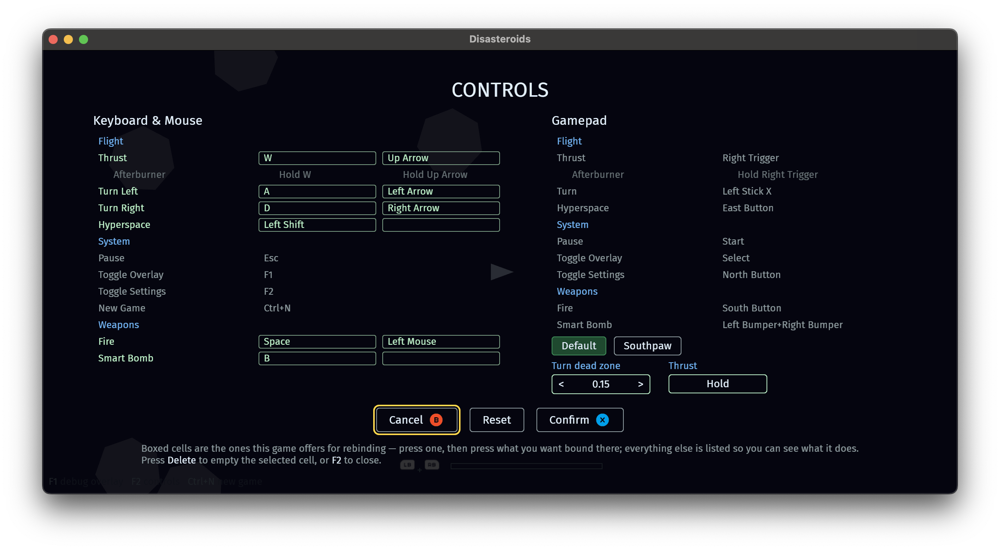

# bevy_action_map

[](#license)

A comprehensive input action manager for [Bevy](https://bevyengine.org).

Declare what your game reacts to, bind whatever devices should drive it, and let players change their minds later.

You define **actions** (`Jump`, `Move`, `Fire`) and **contexts** (`OnFoot`, `InVehicle`, `MainMenu`)
as ordinary Rust types. You bind a mix of keyboard, mouse and gamepad controls to them, with
modifiers and conditions that decide how a hardware signal becomes a game-shaped one. Your gameplay code
then reads `Move` as a `Vec2` and never again mentions `WASD`, a stick, or a dead zone — and when a
player wants to rebind `Jump` to a different key, the crate already has everything it needs to show
them what is bound, let them change it, and keep every prompt on screen in sync.

> **Status: early and public for review, not for production.** The core mapping pipeline —
> keyboard, mouse, gamepad, modifiers, conditions, arbitration, fixed/render tick handling — is
> built and exercised by three example games (below), and the rebinding UI works end to end for
> them, overrides and all. Saved overrides have a documented, human-editable format; putting the
> bytes on disk is still the app's job. This crate isn't published to crates.io, so there's no
> docs.rs page yet. See [Roadmap.md](./Roadmap.md) for what's done and what's left.

## Why



Input management entails more than just "map a `KeyCode` to an enum", because a
shipped game needs more than a mapping:

- **Devices disagree about what a value means.** A mouse delta and a stick deflection are both
  `Vec2`, but one already happened this frame and the other tells you which way to keep moving. The
  crate tracks that distinction as a type (an action's _intent_) and converts between the two
  correctly, instead of leaving you to remember which is which at every call site.
- **Real games have more than one thing listening to the keyboard.** A pause menu, a chat box, and
  a player's ship shouldn't all react to `Escape`. Contexts have priority and consume input, so a
  higher-priority context can claim a control without the lower one ever knowing it happened.
- **Fixed-timestep gameplay drops input if you're not careful.** A press-and-release inside one
  render frame is invisible to `FixedUpdate` unless something remembers it happened. The crate
  queues timestamped events and drains them by time window, so a fixed tick sees every edge transition exactly
  once, however many (or few) times it runs between renders.
- **Players expect to rebind things, and that's usually bolted on later.** The same
  binding declarations that drive gameplay also generate the list a settings screen shows, which
  controls are changeable, and visible prompts ("Press W") that stay correct after a rebind.

## Features

- **Actions and contexts as types.** `#[derive(InputAction)]` and `#[derive(InputContext)]` give you
  compile-time checked reads (`input.value::<Move>()` returns `Vec2`) and
  a declared, stable name for each — the identity that survives a rename or a save file.
- **Keyboard, mouse, and gamepad**, each an optional feature, sharing one pipeline. `no_std` at the
  core (`alloc` only), so the mapping logic itself doesn't require `std`.
- **Multiple bindings per action**, combined — chords (`Ctrl+S`), alternatives (`Space` or
  gamepad South), and composites (WASD as one `Vec2`) all resolve through the same arbitration. A
  binding can also name a whole class of control, which is how "press anything to join" and a text
  field claiming every character key are written.
- **Modifiers**: dead zones, response curves, scale, negate, swizzle, clamping, and rate conversion
  (turning a stick's _position_ into the same per-frame _delta_ a mouse reports).
- **Conditions**: press, release, hold, tap, multi-tap, pulse — composed the way Unreal's triggers
  are, as "any of these" / "all of these" / "none of these must hold."
- **Context activation and priority.** A context can be tied to a game state, a Bevy run condition,
  or driven by hand; a higher-priority context consumes a control before a lower one ever sees it,
  and an exclusive one shuts out everything beneath it for as long as it is up.
- **Fixed and render tick domains**, with a windowed event drain so fixed-timestep gameplay loses no
  edges and duplicates none, whatever the frame rate is doing.
- **Read actions by polling or by observer** — `ContextActions<C>` in a system, or `On<Fired<Jump>>`
  as an entity event, whichever fits the call site.
- **Rebinding, end to end.** The same declarations gameplay uses generate a settings model — which
  controls are shown, which are changeable, primary and secondary slots, two actions deliberately
  sharing one control (tap to dodge, hold to sprint, rebind the control rather than either action).
  Capture takes a new control interactively, with conflict detection and reserved controls a game
  never hands out, and every on-screen prompt updates itself. Prompts read a pad in its own words:
  "Cross" on a DualSense, "A" on an Xbox pad.
- **Saved overrides** in a documented, human-editable format that resolves against what the game
  currently declares — a binding saved by an older build reports itself rather than disappearing.
  Writing the bytes is left to whatever settings layer you already use.
- **Presets and tunables.** Ship alternate control families (`Southpaw`, `Classic`) as named presets
  rather than making players rebind row by row, and expose the settings that aren't controls at all
  — sensitivity, invert-Y, hold-versus-toggle — through the same screen.
- **Local co-op.** Give each player's entity its own context instance and pair it to their devices,
  and neither player sees the other's input. Players join by pressing anything on an unclaimed
  device, and rebind independently without either becoming a default the next player inherits.
- **Diagnostics that answer "why didn't this fire?"** — inactive context, a higher-priority consumer,
  a longer chord winning, an unmet condition, or a device that isn't this player's.

See [Roadmap.md](./Roadmap.md)'s "Where this stands" for the precise, current line between
built and not-yet.

## Quick start

```rust,ignore
use bevy::prelude::*;
use bevy_action_map::prelude::*;

#[derive(InputAction)]
#[action(path = "gameplay.jump", output = bool, intent = Button)]
struct Jump;

#[derive(InputContext)]
#[context(path = "gameplay.on_foot", tick = Render)]
struct OnFoot;

fn main() {
    App::new()
        .add_plugins((DefaultPlugins, ActionMapPlugin))
        .add_context::<OnFoot>(|context| {
            context.bind::<Jump>(KeyCode::Space);
        })
        .add_systems(Startup, |mut commands: Commands| {
            commands.spawn(OnFoot);
        })
        .add_systems(Update, print_jump)
        .run();
}

fn print_jump(input: ContextActions<OnFoot>) {
    if input.fired::<Jump>() {
        println!("Jump fired");
    }
}
```

Run it: `cargo run --example minimal`.

## Concepts

### Actions: what, not how

An action is a type, not a value — `Jump`, `Move`, `Look`. `#[derive(InputAction)]` declares its
**output** (the Rust type your gameplay reads: `bool`, `f32`, `Vec2`, `Vec3`) and its **intent**,
which says what that value _means_:

| Intent         | Meaning                                         | Typical source          |
| -------------- | ----------------------------------------------- | ----------------------- |
| `Button`       | digital, on or off                              | a key, a gamepad button |
| `Analog1`      | a single continuous value                       | a trigger               |
| `Directional2` | a position implying a direction to keep moving  | a stick, WASD           |
| `Delta2`       | a displacement that already happened this frame | mouse motion            |

Intent matters because shape alone can't distinguish a stick from a mouse — both are `Vec2` — but
mixing them up produces camera code that either drifts on its own or never catches up. Modifiers like
`.per_second()` convert between the two explicitly, at the binding, instead of leaving it implicit at
the read site.

Every action also declares a **path** — `"gameplay.jump"` — which is the name that ends up in a
settings file. It doesn't have to match the Rust type name, and shouldn't be updated when the type is
renamed; that stability is the point of declaring it separately.

### Contexts: what's listening right now

A context groups the bindings that are active together: `OnFoot`, `InVehicle`, `MainMenu`. You
assign one to an entity — the player, or a bare entity for input that isn't tied to anything in
particular — and that entity holds the live state for every action in the context. Local multiplayer
starts here: each player's entity gets its own context instance, so nobody shares state, and pairing
that instance to a set of devices is what stops player two's stick moving player one. A context with
no pairing reads everything, which is why none of the above needs mentioning to stay single-player.

A context can be always-on, tied to a `bevy_state` state, driven by any run condition, or flipped by
hand. Contexts also have a priority: while a settings screen's context is active and consumes the
arrow keys for navigation, a lower-priority gameplay context never sees them move the ship — no
manual "pause gameplay input" bookkeeping required.

### Bindings: modifiers and conditions

A binding pairs a control with the action it drives, and reads left to right as a pipeline:

```rust,ignore
context.bind::<Move>(Stick::Left).dead_zone(DeadZone::radial(0.15));
context.bind::<Look>(Stick::Right).curve(1.8).per_second(180.0);
context.bind::<Charge>(KeyCode::Space).hold(0.4);
```

**Modifiers** reshape the raw value — dead zone, response curve, scale, clamp — before it becomes the
action's value. **Conditions** decide _when_ a binding counts as firing: without one, a binding fires
whenever its control is off rest; `.hold(0.4)` instead waits for half a second, reporting progress as
it builds so a UI can show a charge meter. Several bindings can feed one action, and the crate
resolves them by specificity, so `Ctrl+S` beats a plain `S` bound in the same context without either
binding knowing about the other.

A binding's control doesn't have to be a single input: `DirectionalButtons::wasd()` combines four
keys into one **composite**, so `Move` reads a single `Vec2` instead of four buttons the game code
would otherwise have to assemble itself.

A keyboard binding says which of the two things it means. `KeyCode::KeyW` is a position, which is
what movement wants — WASD is a shape under the left hand, and it should stay that shape on an
AZERTY board. `LogicalKey('z')` is the character, which is what an editor-style shortcut wants, so
`Ctrl+Z` lands on the key a French player actually reads as `z`.

### Reading actions: poll or observe

```rust,ignore
fn movement(input: ContextActions<OnFoot>) {
    let dir = input.value::<Move>();     // Vec2, checked at compile time
    if input.fired::<Jump>() { /* ... */ }
}

fn on_jump(_: On<Fired<Jump>>) {
    // an entity event, for code that would rather react than poll
}
```

Every action has a **phase** each tick — `Idle`, `Started`, `Building`, `Fired`, `Firing`,
`Completed`, `Canceled` — so a hold that's building, a hold that just fired, and a hold released too
early are all distinguishable, whether you read it by polling `ContextActions<C>` or by listening
for `Fired<A>` / `Started<A>` / `Completed<A>` / `Canceled<A>` as entity events on the context's own
entity.

### Presentation: mapping and rebinding

The binding API above is a developer's model — dead zones and response curves are implementation
detail nobody rebinding "move forward" should have to think about. Marking a binding `.mappable()`
adds it to a smaller presentation model instead: a named **mapping** with an ordered list of slots
("Primary", "Secondary"), which a settings screen walks without needing to know anything else about
your action or binding declarations. From there the crate can show what's bound, capture a new
control interactively (with conflict detection against everything else in the context), and keep any
on-screen prompt ("Press W") correct across a rebind — see the `mapping` and `present` modules, and
`examples/disasteroids/settings.rs` for a full rebinding screen operable from a gamepad.

## A fuller example

Two device classes, two contexts (one on the fixed tick for gameplay, one on the render tick for
camera look), dead zones and a stick-to-mouse-equivalent rate conversion:

```rust,ignore
use bevy::prelude::*;
use bevy_action_map::prelude::*;
use bevy_input::{gamepad::GamepadButton, keyboard::KeyCode};

#[derive(InputAction)]
#[action(path = "gameplay.move", output = Vec2, intent = Directional2)]
struct Move;

#[derive(InputAction)]
#[action(path = "gameplay.look", output = Vec2, intent = Delta2)]
struct Look;

#[derive(InputAction)]
#[action(path = "gameplay.jump", output = bool, intent = Button)]
struct Jump;

#[derive(InputContext)]
#[context(path = "gameplay.on_foot", tick = Fixed)]
struct OnFoot;

#[derive(InputContext)]
#[context(path = "gameplay.free_look", tick = Render)]
struct FreeLook;

fn main() {
    let mut app = App::new();
    app.add_plugins((DefaultPlugins, ActionMapPlugin));
    app.add_context::<OnFoot>(|context| {
        context.bind::<Move>(DirectionalButtons::wasd());
        context.bind::<Move>(Stick::Left).dead_zone(DeadZone::radial(0.15));
        context.bind::<Jump>(KeyCode::Space);
        context.bind::<Jump>(GamepadButton::South);
    });
    app.add_context::<FreeLook>(|context| {
        context.bind::<Look>(MouseMove);
        context.bind::<Look>(Stick::Right)
            .dead_zone(DeadZone::radial(0.12))
            .curve(1.8)
            .per_second(180.0);
    });
    app.add_systems(Startup, |mut commands: Commands| {
        commands.spawn(OnFoot);
        commands.spawn(FreeLook);
    });
    app.add_systems(FixedUpdate, move_player);
    app.add_systems(Update, look_camera);
    app.run();
}

fn move_player(input: ContextActions<OnFoot>) {
    let dir = input.value::<Move>();
    if input.fired::<Jump>() { /* ... */ }
}

fn look_camera(input: ContextActions<FreeLook>) {
    let delta = input.value::<Look>();
}
```

Run it: `cargo run --example move_and_jump`.

### Disasteroids

`examples/disasteroids` is the crate's proving ground: a small, playable asteroids-like game, driven
entirely through this crate, keyboard or gamepad. Its input layer — seven actions, two gameplay
contexts, and every binding — lives in `examples/disasteroids/actions.rs`, and nothing else in the
game mentions a key or a button. Its `F2`/pad-Y settings screen is a real rebinding UI, with its own
context: it lists every binding without being told about any of them, can be navigated end to end
from a gamepad, and applies a rebind live.

```sh
cargo run --features serialize --example disasteroids
```

Fly with `W`/↑ and `A`/`D` (or ←/→), fire with `Space`, jump with `Left Shift`, pause with `Escape`.
What you rebind is written to a settings file and applied again the next time you launch, which is
what the `serialize` feature is for.

## Other examples

Every example runs from a clean checkout with `cargo run --example <name>`, and between them they
exercise every part of the crate. The three games are where it is worth starting; the rest are
single-concept demos small enough to read in one sitting. The two that keep something between runs
need `--features serialize` as well, marked below.

| Example           | Shows                                                                     |
| ----------------- | ------------------------------------------------------------------------- |
| `disasteroids`    | A full game with a rebinding settings screen, keyboard or gamepad — `serialize` |
| `split_friction`  | Split-screen co-op: two players, two cameras, a device paired to each — `serialize` |
| `pong`            | Two players on one machine, the second pad claimed the moment it appears   |
| `minimal`         | The smallest possible setup                                               |
| `move_and_jump`   | Two device classes, two tick domains, dead zones, a rate conversion        |
| `capture`         | Interactive rebind capture on its own, without a game around it            |
| `text_field`      | A focused text field claiming every character key beside live gameplay     |
| `prompt_gallery`  | Every kind of prompt as text and as icons, under each pad brand and preset |
| `diagnostics`     | What a bad binding declaration reports, and when — no window, no `App`     |
| `ime_diagnostic`  | What a keypress really carries while an IME is composing                   |

## Installing

Not on crates.io yet, so depend on the git repository directly. It targets Bevy `0.20.0-rc.1`, and
your own Bevy dependency has to name that pre-release exactly: a plain `0.20` will not match it
until 0.20.0 is out.

```toml
[dependencies]
bevy_action_map = { git = "https://github.com/viridia/bevy_action_map" }
```

Default features are `std`, `bevy_reflect`, `keyboard`, `mouse`, `gamepad`, and `state`. `touch` and
`focus` are opt-in; `serialize` adds `serde` support for overrides; a `no_std` build needs
`--no-default-features --features libm` to give `glam` a math backend. See `[features]` in
[Cargo.toml](./Cargo.toml) for the complete list.

## Project documents

This crate is being built from a written requirements and design process, kept in the repository
rather than in an issue tracker. Each document answers one question:

| Document | What it is |
| --- | --- |
| [docs/design.md](./docs/design.md) | How the crate works — architecture, the input frame, evaluation, state, the presentation surface, persistence |
| [docs/decisions.md](./docs/decisions.md) | Why it works that way: the decisions expensive to reverse, each with what it rules out and what reversing it would cost |
| [Roadmap.md](./Roadmap.md) | What's left and what's broken — **start here to see current status** |
| [Requirements.md](./Requirements.md) | 221 numbered requirements, with prior art surveyed from LWIM, `bevy_enhanced_input`, Unreal, Unity, Steam Input, and Godot |

Two more, for readers who want the comparison rather than the specification:

| Document | What it is |
| --- | --- |
| [docs/comparison.md](./docs/comparison.md) | How this crate differs from `bevy_enhanced_input` and `leafwing-input-manager`, claim by claim, checked against both crates' source — including which of the two you should probably use instead |
| [docs/one-way-doors.md](./docs/one-way-doors.md) | For the `bevy_enhanced_input` upstreaming discussion: which of its design decisions stop being revisable once it is the engine's answer, what each buys, and what each forecloses |

`archive/` holds the superseded `Design.md` and the work logs. They describe the crate as it was;
`docs/design.md` and `docs/decisions.md` are what replaced them.

## License

Dual-licensed under either of

- Apache License, Version 2.0 ([LICENSE-APACHE](./LICENSE-APACHE))
- MIT license ([LICENSE-MIT](./LICENSE-MIT))

at your option. Unless you explicitly state otherwise, any contribution intentionally submitted for
inclusion in this crate by you shall be dual-licensed as above, without any additional terms or
conditions.
