# How `bevy_action_map` fits together

A guided tour for a new maintainer. It follows one keypress from the device to the game and back out
to the player, and draws each stage so the shape is clear before you open the code.

This document teaches. [`design.md`](./design.md) is the reference: each section here ends with the
`TD` sections that hold the detail, and the `D` entries in [`decisions.md`](./decisions.md) that say
why it was built that way.

This is a snapshot, as of the last commit that touched this file, and is refreshed in batches rather
than with each change. `design.md` is kept current, so where the two differ, it is the authority.

The diagrams are Mermaid, which GitHub and most editors render inline.

---

## The picture on the box

The crate turns device messages into named game actions. It also turns the same declarations into
the data a settings screen and an on-screen prompt are drawn from.

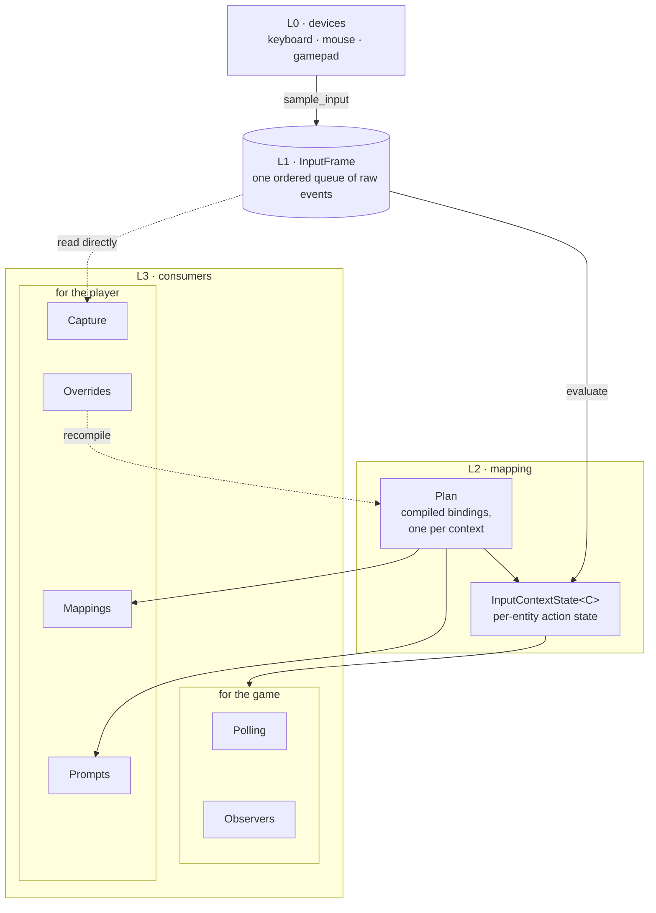

**L2 reads only L1.** Everything downstream of the input frame is a pure function of it. Replay,
tests and a network peer all work by writing into the frame, and nothing above it can tell the
difference from real hardware.

Why: D1, D2. Detail: TD1, TD2.

---

## Vocabulary

A handful of words carry most of the design. They are worth learning before the diagrams.

| Word | Means |
| --- | --- |
| **action** | A Rust type naming something the player does: `Jump`, `Move`. It has an output type (`bool`, `f32`, `Vec2`, `Vec3`), an intent, and a dotted path such as `gameplay.jump` that a settings file stores. |
| **context** | A Rust type grouping bindings that are live together: `OnFoot`, `PauseMenu`. It is a component. |
| **instance** | One entity carrying a context. Four players on foot are four instances of `OnFoot`. |
| **binding** | One way to produce an action: a control, a chain of modifiers, and conditions. An action may have many. |
| **control** | One physical input: a key, a mouse button, a gamepad button, axis or stick. |
| **intent** | What an action's value means: `Button`, `Analog1`, `Directional2`, `Delta2`. It decides how several bindings combine. |
| **tick domain** | Whether a context evaluates once per rendered frame (`Render`) or once per fixed step (`Fixed`). |
| **plan** | A context's bindings, compiled once and shared by every instance. |
| **mapping** | A row on a settings screen: one action in one device family. |

**Slot** has two meanings, and the code uses both. In a plan, an action's *slot* is its index into
the dense state arrays. In a mapping, a *slot* is one cell of the row, the primary or secondary
control. Context tells them apart: `plan.rs` and `eval.rs` mean the first, `mapping.rs` and
`overrides.rs` the second.

Detail: TD3, TD4, TD9.1.

---

## Two times: declaring and running

Nearly everything expensive happens once, when the app is built. At run time the crate reads a
compiled plan and writes into flat arrays.

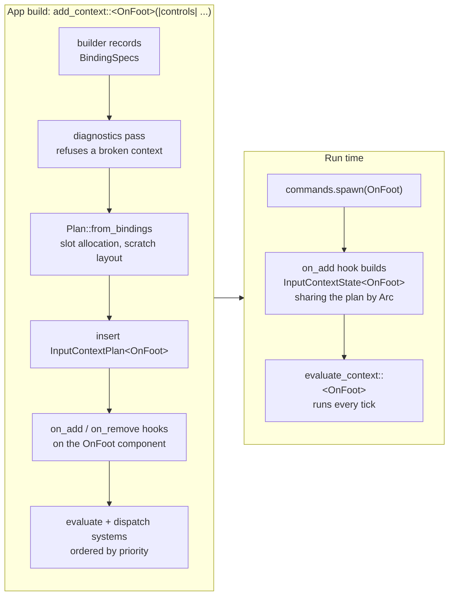

Three consequences follow from this shape.

- **Spawning is enough.** Once a context is declared, any entity that gets the component gets live
  input, including one spawned from a scene.
- **Declare before spawning.** A component hook can only be attached while no entity carries the
  component, so `add_context` panics if one already does.
- **Priority is fixed at build time.** Each context's evaluation system is placed into the schedule
  according to its `PRIORITY` const, so ordering costs nothing per frame (see [Contexts sharing
  controls](#contexts-sharing-controls)).

Why: D5, D10, D11. Detail: TD4, TD7.1.

---

## One frame

This is the path through Bevy's schedules on one rendered frame. The fixed loop may run zero, one or
several times, depending on how much simulated time has built up.

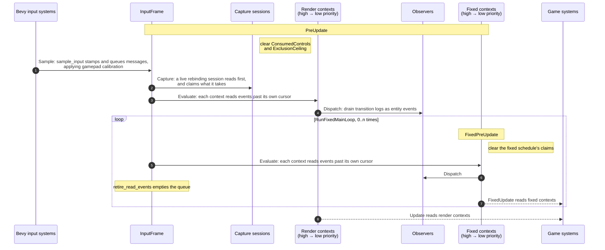

Two things in this picture surprise people.

**The frame is a queue, not a snapshot.** A press and a release inside one rendered frame are both
kept, and a fixed step that spans them sees both. Each context instance keeps a cursor into the
queue, so it reads only what it has not already read.

**Retirement happens in the fixed loop.** That is the one point where every reader is known to have
finished. If the simulation does not step this frame, the queue simply carries over, and the cursors
stop render contexts from reading the same events twice. The queue is capped so it cannot grow
without bound.

```
            sampled in frame N          sampled in frame N+1
          ┌───────┬───────┬─────┐     ┌─────┐
InputFrame│↓Space │↑Space │ ↓W  │     │ ↑W  │      no fixed step ran in frame N,
          └───────┴───────┴─────┘     └─────┘      so nothing was retired
                                 ▲           ▲
              render context's cursor        fixed context's cursor after frame N+1:
              after frame N                  it reads all four events in one step
```

Why: D2, D3, D4, D9. Detail: TD1, TD2.

---

## Inside one evaluation

`evaluate_context::<C, S>` walks every instance of context `C`. For each instance it decides whether
the instance is live, then replays the frame into it.

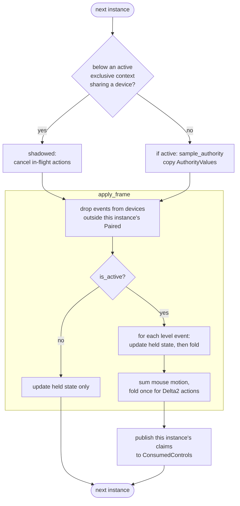

A tick with no events still folds once, so a hold's timer keeps advancing while nothing changes.

A **fold** is one pass over every binding in the plan, producing one value and one phase per action.
It is the heart of the evaluator:

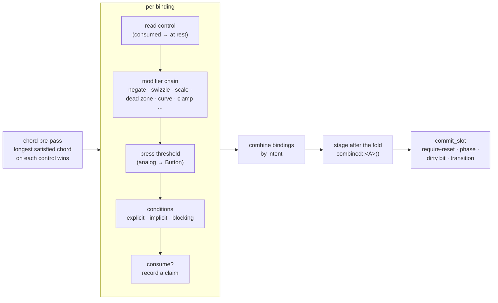

How bindings combine depends on the action's intent:

| Intent | Several bindings become one value by |
| --- | --- |
| `Button` | strongest wins |
| `Analog1`, `Directional2` | per axis, strongest positive plus strongest negative, so opposite directions cancel |
| `Delta2` | summing, since each delta is a displacement that already happened |

Nothing user-defined runs inside the evaluator. It appends to a transition log, and a separate
system in the `Dispatch` set turns the log into observer events afterwards.

Why: D11, D15, D16, D76. Detail: TD5, TD5.1, TD5.5.

---

## The life of an action

Every action has a phase. Some phases are **edges**, true for exactly one tick; the rest are
**levels**, true until something changes. The part of speech gives it away: past participles
(`Started`, `Fired`, `Completed`, `Canceled`) are edges, and `Idle`, `Building`, `Firing` are
levels.

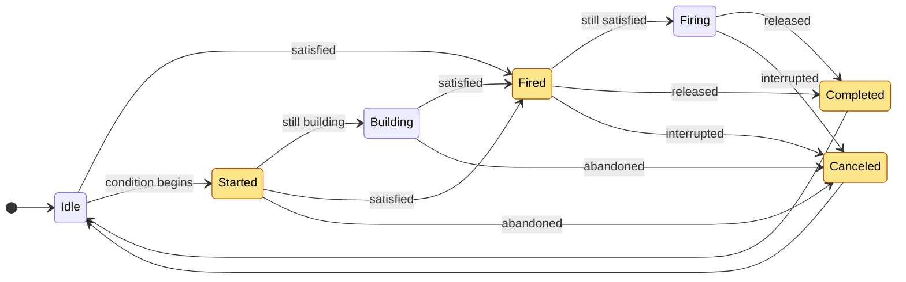

A plain key press with no conditions goes straight from `Idle` to `Fired`, then `Firing` while held,
then `Completed` on release. A `hold(0.5)` passes through `Started` and `Building` while it charges.

**Interrupted** means the source went away rather than the player letting go: the window lost focus,
the gamepad disconnected, or an authority stopped supplying the action. Deactivating or shadowing a
context cancels everything in flight the same way.

**Require-reset** is the other rule to know. When a context activates, a button the player is
already holding does not count as a fresh press; it must be released first. Analog actions are
exempt, since there is no synthesized press to guard against.

Why: D18, D62, D63. Detail: TD3.2, TD5.6, TD5.7, TD7.2.

---

## Where state lives

State is split between the context entity, per-context resources, and a few world-wide resources.

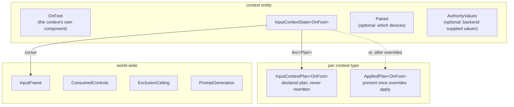

Inside `InputContextState`, action state is two dense arrays of `Copy` values indexed by plan slot.
The plan holds every parameter (durations, thresholds, curves), so the per-tick state stays small
and uniform:

```
plan slot          0            1            2
                ┌────────────┬────────────┬────────────┐
ActionState     │ Jump       │ Move       │ Sprint     │   value and phase, one per action
dirty           │ 1          │ 0          │ 0          │   changed this tick
require_reset   │ 0          │ 0          │ 1          │   waiting for a release
disabled        │ 0          │ 0          │ 0          │
                └────────────┴────────────┴────────────┘

scratch slot       0            1            2
                ┌────────────┬────────────┬────────────┐
Scratch         │ hold timer │ tap count  │ toggle     │   one per condition or stateful
                │            │            │ latch      │   modifier, then one per action's
                └────────────┴────────────┴────────────┘   stage after the fold
```

`InputContextState` holds no ECS references, so a test can drive one directly. Activation flips a
flag: nothing is spawned, inserted or removed.

Why: D8, D10. Detail: TD4, TD6.

---

## Contexts sharing controls

Most games have several contexts alive at once: gameplay, a pause menu, a vehicle. Three mechanisms
decide who gets a control.

**Priority orders evaluation.** A higher `PRIORITY` evaluates earlier. Two contexts at the same
priority evaluate in the order they were declared with `add_context`.

**Consumption hides a control from later contexts.** A binding marked `consume` claims its controls
while its conditions are building or satisfied. Contexts evaluated afterwards read those controls as
untouched.

**Exclusivity switches lower contexts off.** An `exclusive` context, while active, shadows every
lower-priority context that shares a device with it.

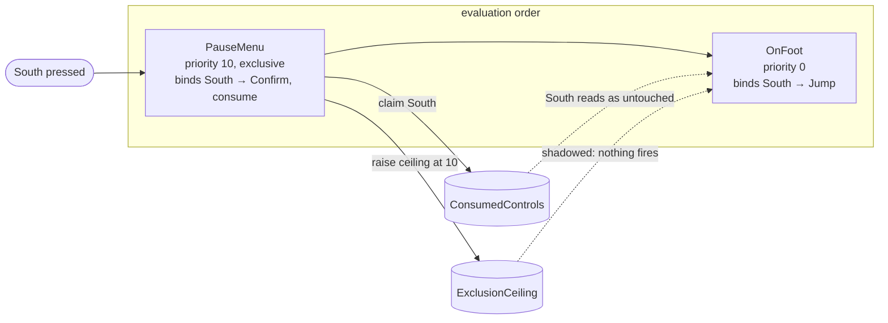

Claims and the ceiling are both **scoped by device**. Each records the devices of the instance that
made it, and reaches only readers sharing one. That is what makes local multiplayer work without
special cases:

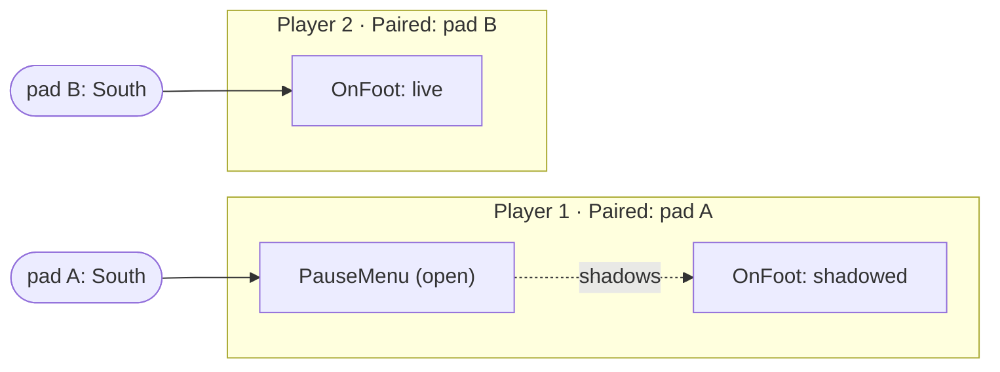

A context with no `Paired` reads every device. That is the single-player case, and it needs no
setup.

Consumption flows forward through the schedule: a render context can take a control from a fixed
one, never the reverse. Claims are cleared at the top of each frame, and the fixed schedule clears
its own claims on each step.

Why: D11, D12, D13, D52, D88. Detail: TD5.1, TD5.2, TD5.3, TD7.4.

---

## Reading actions in game code

There are two ways to consume an action, and both are cheap.

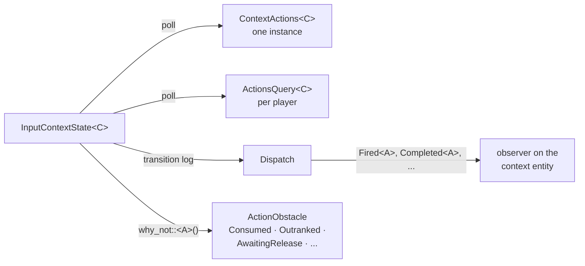

Polling suits continuous input such as movement. Observers suit discrete events, and because events
target the context entity, a `bsn!` scene can attach them with `on()` and no adapter. Dispatch cost
is proportional to the number of transitions, so an idle frame costs nothing.

`why_not` is the debugging tool: it tells you why an action did not fire, whether a stronger context
consumed the control, a longer chord outranked it, or the player has not yet released a held key.

Detail: TD5.6, TD7.3.

---

## Going back out to the player

Up to here, input has flowed inward. The presentation surface runs the other way: from declarations
to things a player reads. It has three parts, and each reads from a different place.

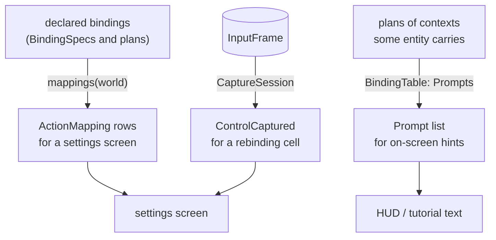

| | Reads | Answers |
| --- | --- | --- |
| **Mappings** | what the game declared | "what can the player rebind?" Static, and includes contexts nobody has spawned yet. |
| **Prompts** | plans of carried contexts | "what is this action bound to right now?" Includes private bindings, and ignores activation. |
| **Capture** | the frame directly | "what did the player just press?" Works with no gameplay context spawned. |

Everything here is a key, never a rendered string. A mapping's key (`gameplay.move.up`) is a
localization key, and a control's name is a stable identifier the game's own catalogue translates.
`fallback_label` exists for a game that ships no catalogue.

Prompts are an open trait rather than a function, because the crate's tables are not always the
authority: a platform input service can answer instead. `PromptGeneration` is bumped whenever the
answer could change, so a UI knows when to redraw.

Why: D27, D31, D34, D35, D40, D91. Detail: TD9.

---

## A rebinding, end to end

This is the whole round trip a settings screen drives, from the player pressing a cell to the
setting surviving a restart.

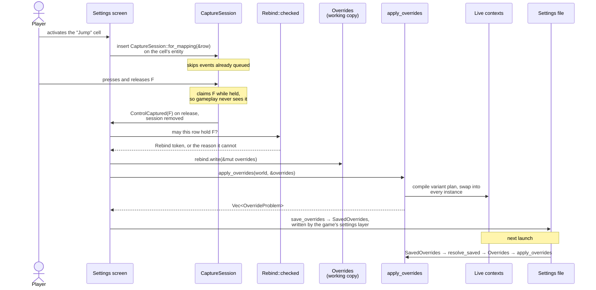

Three rules shape this flow:

- **The whole working copy goes in every time.** Each apply starts again from the declared defaults.
  A preset's rows and the player's own captures are merged by the game into one `Overrides` first.
- **A row is applied whole or refused whole.** Problems come back as a list and are never dropped.
- **Conflicts are detected, not resolved.** `conflicts(world, candidate, target)` answers whether a
  control is already used elsewhere; what to do about it is the screen's decision.

Why: D41, D43, D45, D47, D59, D89. Detail: TD9.3, TD10.

---

## Plans across an override

Applying overrides never edits a compiled plan. It goes back to the authored bindings, rewrites
them, and compiles again.

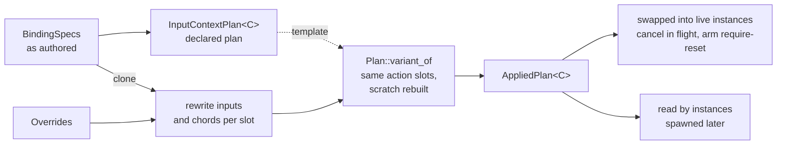

The declared plan is kept untouched, so defaults revised in a later version of the game still reach
players who never changed that row. A variant keeps the declared slot allocation, so action state
lines up across the swap, and an action the player unbound entirely reads as at rest.

`apply_overrides_for` applies to one entity's instance only, which is how two players sharing a
context type keep separate bindings.

Why: D47, D48. Detail: TD4, TD10.1.

---

## Where backends plug in

There are two entry points for input that does not come from Bevy's own device messages.

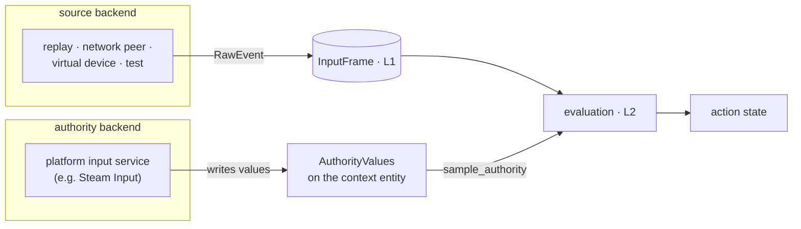

A **source** backend writes raw events into the frame. Everything above it treats those events
exactly like hardware.

An **authority** backend supplies already-resolved values for one device family, in place of this
crate's bindings for that family. The game declares this with `bind::<A>(Authority(family))`. Such a
binding reads the authority's value and then behaves like any other: its modifiers and conditions
run, and it folds with the action's other bindings. It has no control, so it cannot be consumed or
captured, and its mapping row is `Delegated` to the backend's own binding screen.

Gamepad entities also carry facts a backend can supply: `ConnectedGamepad` (it is available),
`Brand` (whose button names to use), and `Identity` (which physical device this is, for a save
file).

Why: D22, D51, D71, D92. Detail: TD5.8, TD7.5–TD7.7.

---

## Finding your way in the code

Modules grouped by role. The layer labels match the first diagram.

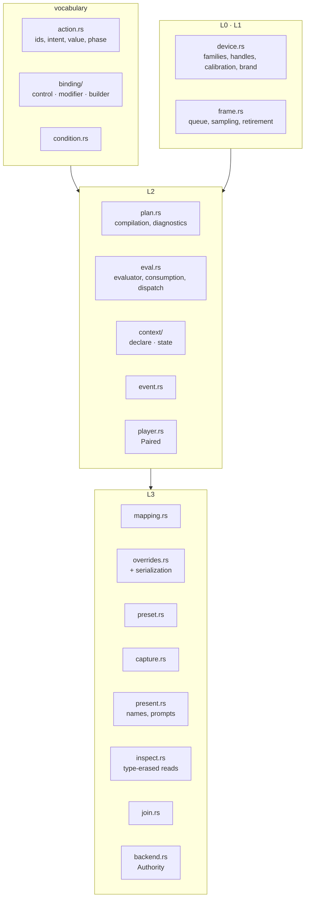

A reading order that follows a keypress through the code:

1. `ActionMapPlugin::build` in `lib.rs`: the system sets and what runs where.
2. `add_context` in `context/declare.rs`: what declaring a context produces.
3. `Plan::from_bindings` and `Plan::compile` in `plan.rs`: slots and scratch.
4. `sample_input` in `frame.rs`: how messages become the queue.
5. `evaluate_context`, then `apply_frame`, then `commit_slot` in `eval.rs`: the fold and its phases.
6. `dispatch_for` in `event.rs`: from a transition to an observer event.
7. `mapping.rs`, then `overrides.rs`: the presentation surface and the way back in.

The derives live in `macros/`. The examples are the acceptance tests: `minimal` is the smallest
complete program, and `disasteroids` exercises nearly everything, including a full controls screen.

Detail: TD11.

---

## Where to go next

| To learn | Open |
| --- | --- |
| exactly how a mechanism behaves | [`design.md`](./design.md), by `TD` section |
| why it was built that way | [`decisions.md`](./decisions.md), by `D` entry |
| what must remain true | [`Requirements.md`](../Requirements.md) |
| what is known to be wrong | [`issues.md`](./issues.md) |
| what is being built next | [`Roadmap.md`](../Roadmap.md) |
| how this project judges scope and code | [`guidelines.md`](./guidelines.md) |
